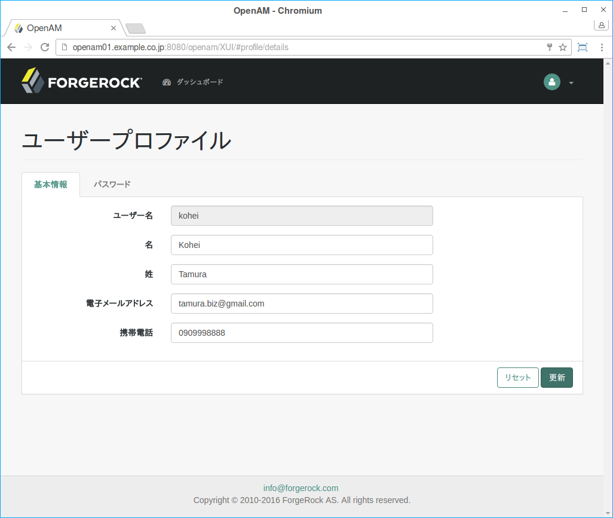

### OpenAM管理コンソール

OpenAMの初期設定が完了すると、初期設定時に設定したパスワードを使用して、OpenAMの管理者(amadmin)でWebベースの管理コンソールにログインできます。http://openam.example.com:8080/openam のようなURLにアクセスします。
この場合、HTTPプロトコルを介して、FQDN(openam.example.com)上の、Java EE標準のWebコンテナのポート番号(8080)に、指定したデプロイメントURI(/openam)に、通信が行われます。

図. OpenAM管理コンソール

OpenAMの管理者でログインすると、管理コンソールへの完全なアクセス権があります。OpenAMは、セッションが期限切れになるか、ログアウトするか、ブラウザを閉じるまで、セッションを持続するようにブラウザにクッキーを設定します。

管理者以外のエンドユーザーで管理コンソールにログインしても、管理コンソールへのアクセス権はありません。アクセスはセルフサービスのプロフィールページとユーザー向けのダッシュボードに制限されています。

図. 管理者以外のユーザーのOpenAMコンソール

別のユーザーに管理機能を付与するようにOpenAMを設定した場合、そのユーザーは管理可能なレルム内の管理コンソール、およびセルフサービスプロファイルページの両方にアクセスすることができます。

図. 委任された管理者のOpenAM管理コンソール

委任管理の詳細については、管理者ガイドの「Delegating Realm Administration Privileges」を参照してください。

#### OpenAM管理コンソールの構成

OpenAM管理コンソールで設定可能な項目は多数有りますが、設定がどの範囲で適用できるかで設定個所が変わってきます。この範囲には以下があります。

- グローバル
- レルム

「グローバル」は、OpenAMサーバー全体を意味します。「グローバル」レベルの設定は、OpenAMサーバーに共通で適用されます。
「レルム」は、組織毎に要件が異なる場合に対応できるように、設定情報を整理するために使用する単位です。
例えば、営業、マーケティング、エンジニアリングのそれぞれの組織に対して、認証の方式や認可ポリシー、データストアなどを変えたい場合は、レルムを使います。
レルムは階層構造で定義することができます。最上位のレルムは「/」(ルート)といいます。
その下に「/sales」、「/marketing」、「/engineering」、「/engineering/mechanical」、「/engineering/electrical」というように階層構造でレルムを定義することができます。

レルムに対する設定は、グローバルに対する設定に優先して適用されます。また、下位のレルムの設定は、上位のレルムの設定に優先して適用されます。
