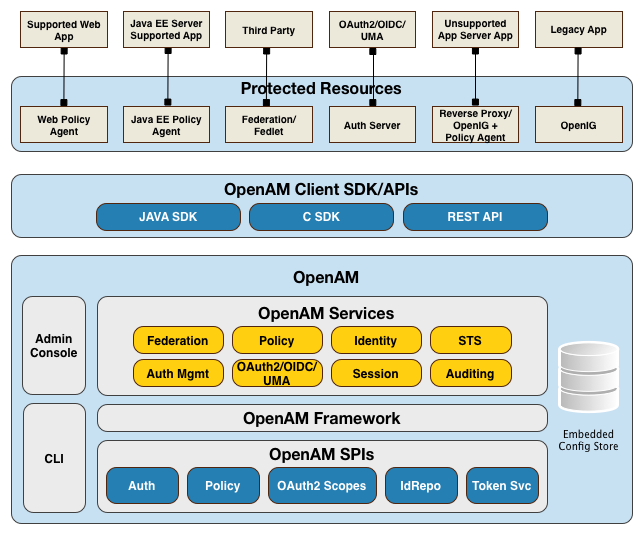

### OpenAMのアーキテクチャ

OpenAMは、オープンソースの集約型アクセス管理サーバーで、ネットワーク経由で保護されたリソースをセキュアにし、単一で統合されたソリューションによる認証、認可、Webセキュリティ、フェデレーション・サービスを提供しています。
OpenAMは、クラウド、エンタープライズ、モバイル、企業間（B2B）システムに対して、異種のハードウェアおよびソフトウェアのサービスを一元化することで、誰が、どの期間に、どのような条件下でアクセス権があるかを制御することにより、保護されたリソースへのアクセスを管理します。

図. OpenAMのアーキテクチャ

OpenAMは、どのような顧客の配備にも合うように、複数のプラグインポイントと高度にモジュール化された柔軟なアーキテクチャを備えています。
HTTP、XML、SOAP、REST、SAML 2.0、OAuth 2.0、OpenID Connect 1.0のような業界標準のプロトコルを活用し、ネットワークを介して、高いパフォーマンス、スケーラビリティ、可用性のあるアクセス管理ソリューションを実現します。
OpenAMのサービスは、100％Javaで実装されており、様々なプラットフォームやコンテナで構成された多くの本番環境において動作が実証済みです。

OpenAMコアサーバーは、既存のネットワークインフラストラクチャ内に配備、統合することができます。 OpenAMは、以下のディストリビューションファイルを提供しています。

表. OpenAMのディストリビューションファイル

|ディストリビューション|説明|配備|?|
|---|---|---|---|
|デフォルト|OpenAM's default distribution .war file includes the core server code with an embedded OpenDJ directory server, which stores configuration data and simplifies deployments. The distribution includes an administrative graphical user interface (GUI) Web console. During installation, the .war file accesses a bootstrap file to obtain the fully qualified domain name, port, context path, and the location of the configuration folder.|Y|N|
|コアサーバーのみ|OpenAM provides a core server-only .war file without the OpenAM Console. This setup is often used in multi-server deployments wherein the deployments is managed using a full server instance using the ssoadm command-line tool. The OpenAM server installs with an embedded OpenDJ directory server.|Y|N|
|アイデンティティプロバイダ(IdP)・ディスカバリーサービス|OpenAM provides an IdP Discovery Profile (SAMLv2 binding profile) for its IdP Discovery service. The profile keeps track of the identity providers for each user.|Y|N|
|OpenAMクライアントJava SDK|OpenAM provides a smaller subset of the OpenAM SDK, providing client-side API to OpenAM services. The Client SDK allows you to write remote standalone or Web applications to access OpenAM and run its core services.|Y|N|
