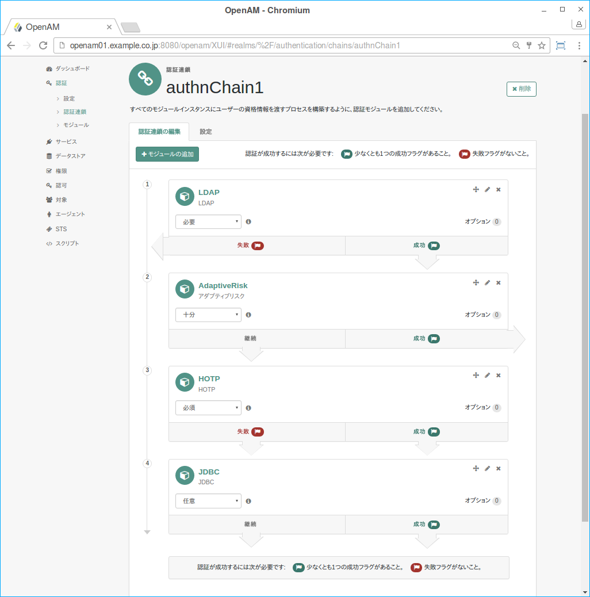

OpenAMは複数の認証モジュールを組み合わせることで、よりセキュアな認証を可能にする「多要素認証」機能を実装しています。この認証モジュールの組み合わせを「認証連鎖」といいます。図1は認証連鎖の設定例です。
認証連鎖内の各認証モジュールには、実行後の動作を決定する「条件」を設定します。条件には以下の4種類があります。

|条件|実行後の動作|
|---|---|
|オプション（optional）|認証モジュールの成功は必須ではありません。成功するかどうかに関係なく、リスト内の次の認証モジュールに進みます。|
|十分（sufficient）|認証モジュールの成功は必須ではありません。成功すると、リスト内の次の認証モジュールに進みません。失敗すると、リスト内の次の認証モジュールに進みます。|
|必須（requisite）|認証モジュールの成功が必要です。成功すると、リスト内の次の認証モジュールに進みます。失敗すると、リスト内の次の認証モジュールに進みません。|
|必要（required）|認証モジュールの成功が必要です。成功するかどうかに関係なく、リスト内の次の認証モジュールに進みます。|

図. 認証連鎖のサンプル

この図で示した認証連鎖を設定した場合、各認証の成否と全体の結果は以下のようになります。

|認証モジュール|パターン1|パターン2|パターン3|パターン4|パターン5|パターン6|パターン7|パターン8|
|---|---|---|---|---|---|---|---|---|
|LDAP認証（必要）|成功|成功|成功|成功|失敗|失敗|失敗|失敗|
|アダプティブリスク認証（十分）|成功|失敗|失敗|失敗|成功|失敗|失敗|失敗|
|HOTP認証（必須）|ー|成功|成功|失敗|ー|成功|成功|失敗|
|JDBC認証（オプション）|ー|成功|失敗|ー|ー|成功|失敗|ー|
|全体の認証結果|成功|成功|成功|失敗|失敗|失敗|失敗|失敗|

2～4回の認証が求められ、その中の一部で失敗があっても全体としては成功となることもあります。
