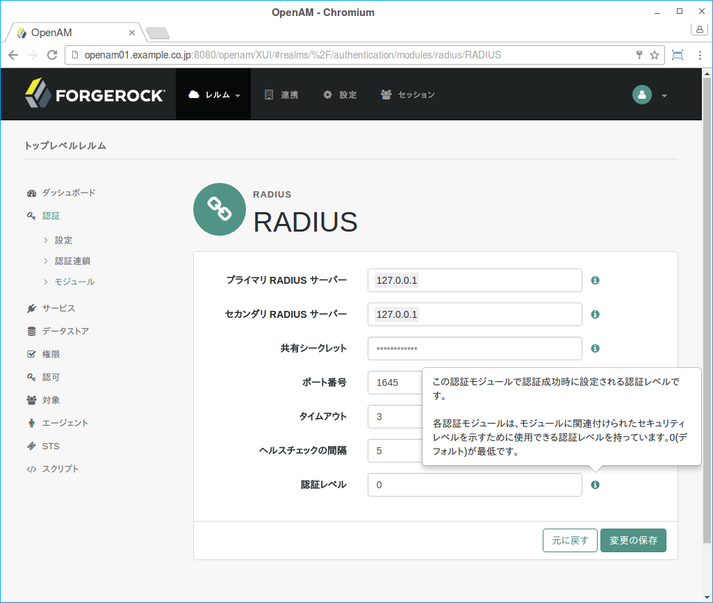

[TODO 作成中]

## 認証レベルについて

管理コンソールで認証モジュールの設定画面を見ると、全ての認証モジュールには「認証レベル」が設定されていることが分かります。

図. 認証レベルの設定

認証レベルには、モジュールに関連付けるセキュリティレベルを設定します。より強固な認証方式にはより高い認証レベルが割り当てます。（または配備が低い認証レベルで強力な認証を定義する場合は、より低い認証レベル。）

ユーザーを正常に認証すると、OpenAMはセッションを作成し、それによりリソースへのユーザーのアクセスを管理することができるようになります。セッションには認証レベルが割り当てられており、認証が成功した認証モジュールの中で最も高い認証レベルと計算されます。ユーザーが要求したリソースにアクセスするために、ユーザーのセッションが適切な認証レベルを持っていない場合は、より高い認証レベルで再認証を要求される場合があります。

認証連鎖に、「必須」または「必要」の認証モジュールが含まれており、それらの前に「十分」の認証モジュールが存在する場合、「十分」の認証モジュールで認証が成功すると、その時点で認証は成功になり、セッションの認証レベルは、次のどちらか大きい方で計算されます。
- 通過した認証モジュールの中で最も高い認証レベル
- 実行されなかった「必須」または「必要」の認証モジュールの最も高い認証レベル

実行されなかった「必須」または「必要」の認証モジュールが認証連鎖に存在する場合であっても、セッションの認証レベルが常に通過した任意の認証モジュールの最も高い認証レベルになるように、OpenAMのデフォルトの動作を変更することができます。

デフォルトの動作を変更するには、配備 > サーバー > サーバー名 > 高度 でorg.forgerock.openam.authLevel.excludeRequiredOrRequisiteプロパティをtrueに設定してOpenAMを再起動して下さい。

いくつかの配備では、1ユーザーに対するアクティブなセッション数を制限する必要があります。例えば、一度に2個以上のデバイスを使用するユーザーからのログインを防ぐ必要がある場合があります。手順については、設定セッションの割り当て制限を参照してください。

### 認証レベルとセッションアップグレード

認可ポリシーは、機密リソースへのアクセスのために特定の認証レベルを要求することができます（指定された認証レベル以上または以下）。すでにレルムで認証されたユーザーが、必要な認証レベルを持っていない有効なセッションで、センシティブなリソースにアクセスしようとすると、OpenAMはリソースへのアクセスを拒否します。しかし、OpenAMは、認可決定とともにアドバイスも返します。アドバイスは、必要な認証レベルの必要性を示します。ポリシーエージェントまたはポリシー実施ポイントは、セッションアップグレードのためにOpenAMにユーザーを送信することができます。

セッションアップグレード中に、ユーザーはより強力な認証モジュールで認証します。強力なモジュールは、一般的に元の認証を処理したモジュールと同じ認証連鎖の一部として構成します(センシティブではない、リソースにアクセスするために必要ではないが)。より強力な認証が成功すると、ユーザーセッションは新しい認証レベルにアップグレードし、より強力な認証に関連するすべての設定を含むように修正されます。

失敗した場合、セッションアップグレードはユーザーセッションをより強力な認証での試みがあった以前のままにします。ログインページのタイムアウトのためセッションのアップグレードが失敗した場合、最後に成功した認証からOpenAMは成功URLにユーザーのブラウザをリダイレクトします。

OpenAMのポリシーエージェントは、OpenAMのアドバイスを処理するようにビルドされているため、一般的に追加設定無しでセッションアップグレードを処理できます。独自のポリシー実施ポイント（PEP）を構築した場合は、アドバイスやセッションアップグレードを考慮に入れて下さい。RESTfulなPEPについては、ポリシー決定の要求を参照してください。アドバイスやセッションアップグレードを処理する方法については、認証とログアウトを参照してください。

セッションアップグレードのOpenAMのサポートは、ステートフルセッションを必要とします。OpenAMのセッションをアップグレードしようとする前に、OpenAMがステートフルセッション用に設定されていることを確認してください(デフォルト設定)。
