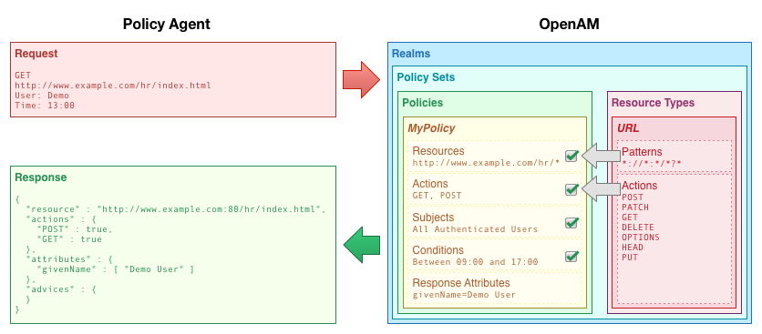
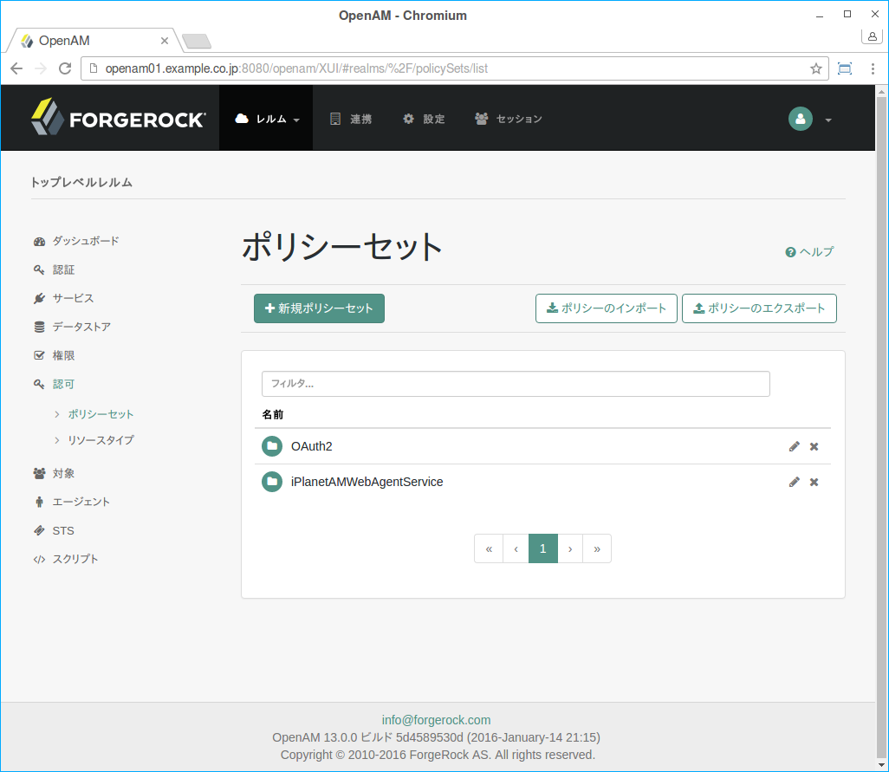

[TODO 作成中]

## 認可

アクセス管理は主に認証と認可に分けられます。前の章では、認証について説明しましたが、この章では認可について説明します。認証は誰がリソースにアクセスしようとしているかを判定することであるのに対して、認可はリソースへのユーザーのアクセスを許可または拒否することを意味します。ポリシーは、それについて判断する方法を定義したものです。以降では、OpenAMで認可のためのポリシーを設定する方法について説明します。

### OpenAMでの認可について

OpenAMは、アプリケーションへのユーザーのアクセスを管理します。一般的にアクセスが許可されたかどうかは、次の条件に依存します。

- アクセスに対してポリシーがどのようなものであるか
- 誰がアクセス権を取得しようとしているか
- アクセス自体は安全なチャネルを介している必要があるかどうか
- アクセスがいつであるか　など

#### OpenAMにおけるリソースタイプ、ポリシーセット、ポリシー

OpenAMでは、リソースへの対象のアクセスを許可するかどうかを決定できるように認可ポリシーを定義します。

ポリシーは、次のように定義します:

**リソース (resources)**  
リソースには、Webページへのアクセスのような、どのリソースにポリシーが適用されるかを示す制約を定義します。

**アクション (actions)**  
アクションは、Webページを読み込む、Webフォームをサブミットするといった、ポリシーによりユーザーがリソースに行えることを説明する動詞を表します。

**対象条件 (subject conditions)**  
対象条件は、すべての認証済みユーザー、管理者のみ、というような、ポリシーが適用される人を制約します。

**環境条件 (environment conditions)**  
環境条件は、勤務時間中のみ、特定のIPアドレスからのアクセスのみ、というような、ポリシーが適用される状況下を設定します。

**応答属性 (response attributes)**  
OpenAMがポリシーの決定に従い応答に付加する属性情報(名前、メールアドレスなど)を定義します。

保護されたリソースにユーザーをアクセスできるようにするかどうかについて照会すると、OpenAMはポリシーの決定において、以下に説明するように適用可能なポリシーに基づいてアクセスを許可するかどうかを決定します。OpenAMは、アクセス管理のためにOpenAMを使用しているアプリケーションにその決定を伝えます。一般的なケースでは、これはアプリケーションが実行されるサーバーにインストールされたポリシーエージェントです。エージェントは、OpenAMからの認可決定を実施します。

図. レルム、ポリシー、ポリシーセットの関係

ポリシーの作成を支援するために、OpenAMは、リソースタイプとポリシーセットを使用します。

**リソースタイプ (Resource types)**  
リソースタイプは、ポリシーを適用するリソースとそれらのリソース上で実行することができるアクションについてのテンプレートです。

例えば、OpenAMにデフォルトで含まれているリソースタイプである「URL」は、Webページやアプリケーションを保護するためのテンプレートとして機能します。この中には「\*://\*:\*/\*?\*」のようなリソースパターンが含まれており、ポリシーを定義する際に、より具体的なパターンに変更することができます。サポートするアクションには、次のものが含まれます:

- GET
- POST
- PUT
- HEAD
- PATCH
- DELETE
- OPTIONS

OpenAMには、 https://\*:\*/\*?\* とCRUDPAQアクションを含むパターンで、RESTエンドポイントを保護するためのリソースタイプも含まれています(※ただし、これは管理コンソール上には表示されません):

- CREATE
- READ
- UPDATE
- DELETE
- PATCH
- ACTION
- QUERY

**ポリシーセット (Policy Sets)**  
ポリシーセットは、リソースタイプのセットと関連付けられており、それらが提供するテンプレートに基づいた1つ以上のポリシーを含んでいます。

例えば、Example.comの人事サービスのためのアプリケーションは、HTTP GETとPOSTアクションのみhttp*://example.com/hr* と http*://example.com/hr*?* の下にURLリソースタイプを適用するすべてのポリシーを制約する、リソースタイプが含まれている場合があります。

管理コンソールの レルム > レルム名 > 認可 でポリシーセット、ポリシー、リソースタイプを設定します。

図. 管理コンソールのポリシーセット

ポリシーおよびリソースタイプの閲覧、作成、編集の詳細については、リソースタイプ、ポリシーセット、ポリシーの設定を参照してください。

#### OpenAMのポリシー決定

OpenAMにおいて、リソースへのアクセスを許可するかどうかの認可決定は、ポリシーに依存しています。ポリシーエージェントはポリシー強制点（PEP）として動作するのに対し、OpenAMはポリシー決定点（PDP）として機能します。つまり、ポリシーエージェントや他のPEPは、OpenAMによって決定されるポリシーを実施するためだけの責任を取ります。OpenAMにアプリケーションとそのポリシーを設定した場合、ポリシー管理点（PAP）としてOpenAMを使用します。

具体的には、PEPがOpenAMにポリシー決定を要求するとき、対象リソース（ポリシーセット（デフォルト：iPlanetAMWebAgentService））と、対象と環境に関する情報を指定します。ターゲットリソースに適用する指定されたポリシーセット内のPDPとしてのOpenAMはポリシーを取得します。OpenAMは、対象と環境に関する情報と一致する条件に基づいて決定を行うために、これらのポリシーを評価します。複数のポリシーを特定のリソースに適用するとき、組み合わせている決定のためのデフォルトのロジックは、アクセスを拒否することの決定となる最初の評価は他のすべての評価よりも優先されることです。該当するすべてのポリシーがアクセスを許可する決定に評価された場合、OpenAMはアクセスのみを許可します。

OpenAMは、PEPにポリシー決定の通信をします。具体的な決定(指定された条件の下で対象のポリシーを適用する)は、エンタイトルメントと呼ばれています。

エンタイトルメントは、適用するリソースを示します(各リソースを許可および拒否されるアクションや、必要に応じて応答属性とアドバイス)。

条件の不一致に起因して要求を拒否した場合、OpenAMはPEPにアドバイスを送ることができ、その後PEPは対応策を実施することができます。例えば、ユーザーがウェブサイトでメールアドレスとパスワードを入力して、認証済みになり認証レベルが0で設定されていると仮定します。別のページにアクセスする上でワンタイムパスワードを使用したレベル1の認証を必要となった場合、OpenAMはPEPにユーザーの再認証を促すアドバイスを送り、ワンタイムパスワードの認証モジュールを使用して認証レベル1を獲得し、保護されたページへのアクセスを許可します。

#### 認可の例

OpenAMがユーザープロファイルWebページを保護するケースを考えてみましょう。Webサーバーにインストールされたポリシーエージェントは、ポリシーを適用するためクライアントからのリクエストをインターセプトします。ポリシーは、認証済みのユーザーのみが自分のプロファイルを閲覧・更新するために、ページにアクセスできることを示します。

ユーザーがプロファイルページをアクセスすると、ポリシーエージェントはリクエストをインターセプトします。ポリシーエージェントは、そのリクエストが保護されたリソースへのアクセスであるが、ページを表示する一切の認可を得ていない未ログインのユーザーからのものであることに気付きます。この場合、ポリシーエージェントはユーザーをOpenAMのログインページにリダイレクトします。

OpenAMは、リダイレクトされたユーザーに対して、ログインページを表示します。そして、入力されたメールアドレスとパスワードにより、ユーザーを認証し、セッションを作成します。その後、OpenAMは、ポリシーエージェントにユーザーをリダイレクトし、ポリシーエージェントはOpenAMからポリシー決定を取得して、ページへのアクセスを許可します。

ユーザーは、OpenAMとの有効なセッションを持っていれば、再び自分のメールアドレスとパスワードを入力しなくても、ブラウザ内の別のページに遷移したり、プロファイルページへ戻ることができます。

この例の中で、OpenAMとポリシーエージェントがアクセスを処理する方法に注目してください。Webサイトの開発者は、プロフィールページを提供することができますが、ログインを管理することや、誰がページにアクセスできるかを扱うことは決してできません。OpenAM管理者であれば、Webサイトへの更新とは無関係に、認証と認可を変更することができます。ログインする際にどのようにユーザーを識別するかは、Webサイトの開発者に確認する必要があります。認証と認可のためにOpenAMとポリシーエージェントを使用することにより、ユーザーをローミングするためにイントラネットへの外部からのアクセスを追加したい時、サイトのいくつかをパートナーに公開したい時、人事ウェブサイトの特定のページに管理者だけをアクセスできるようにしたい時、デスクトップPCにログオンしたユーザーに再認証を要求したくない時でも、Webアプリケーションを更新する必要がなくなります。

### OpenAMがどのようにポリシー決定に到るか

OpenAMは、ポリシー決定を行うリソースへのポリシーに合致する必要があります。ポリシーが合致するには、リソースはポリシーで定義されたリソースのパターンのいずれかに合致する必要があります。要求を行ったユーザーは、主体と合致する必要があります。また、各条件タイプの少なくとも1つの条件を満たさなければなりません。

複数のポリシーが一致した場合、OpenAMは差異を調整する必要があります。ポリシー決定を行うためにそれらを使用する順序は、確定的ではありません。しかしながら、拒否(deny)の決定は許可(allow)の決定を上書きされ、デフォルトではOpenAMが拒否の決定に到ると、それ以降のポリシーをチェックを停止します。拒否にもかかわらず、OpenAMにチェックを続けさせたい場合は、設定 > グローバルサービス に移動し、ポリシー設定をクリックします。そして、「拒否の決定後に評価を継続する」を可能にします。
