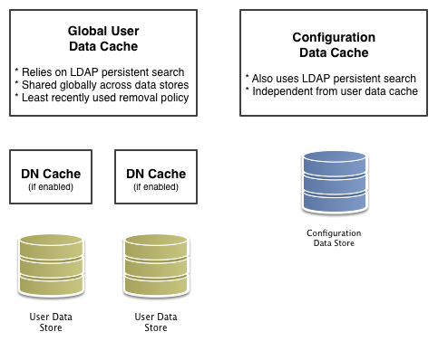

### OpenAMでのキャッシング

ユーザー情報や設定情報を必要とするたびに、データストアを照会する必要がなくなるように、OpenAMはデータをキャッシュします。デフォルトでOpenAMは、キャッシュされたデータへの変更の通知を受信できるように、LDAP持続検索を使用します。そういった理由から、LDAP持続検索をサポートするディレクトリサーバーにデータが保存されるときは、キャッシングすることが推奨されます。

OpenAMには、サーバー側で設定することができる2種類(設定データ用とユーザーデータ用)のキャッシュがあります。一般的に、設定データキャッシュに対してはデフォルト設定を使用します。このセクションでは、主にユーザーデータのキャッシュの設定について解説します。

OpenAMは、ユーザーデータストアに対するグローバルユーザーデータキャッシュを実装しています。 OpenAM  11.0以前では、二次生存期間(TTL)データストアキャッシュ層をサポートしていましたが、OpenAM 11.0以降のバージョンで削除されました。

ユーザーデータストアは、認証時に爆発的に発生する傾向があるDNルックアップをキャッシュするために使用される、DNキャッシュをサポートしています。ベースとなるLDAPストアのユーザーが移動したり、名前が変更されると(常に持続検索の結果に反映されないイベントが発生すると)、DNキャッシュが古くなる可能性があります。ベースとなるLDAPストアは、持続的な検索やDN更新操作をサポートしている場合(つまり、DNの移動または名前を変更することができる場合)、DNキャッシュを有効にすることができます。

次の図は、2種類のキャッシュと、ユーザーデータのために利用可能なキャッシュの2つのタイプを示しています。

図. OpenAMのキャッシュ

このセクションの残りの部分では、グローバルユーザーデータキャッシュとSDKクライアントのための主な設定を解説します。
データストアのキャッシュ設定については、"表. LDAPデータストアの設定"を参照してください。

#### 全体的なサーバーのキャッシュ設定

デフォルトでOpenAMは、設定データとユーザーデータの両方のキャッシュを有効にしています。これは、サーバープロパティcom.iplanet.am.sdk.caching.enabledによって制御されており、デフォルトでtrueです。このプロパティをfalseに設定すると、設定データとユーザーデータのキャッシュを個々に有効にできます。

**手順. グローバルユーザーデータ・キャッシングをオフにする**

キャッシュを無効にすると、性能に深刻な悪影響を与える可能性があります。キャッシュが無効な場合、OpenAMは必要とするたびにデータストアにデータを照会しなければならないためです。

ただし、LDAP持続検索をサポートしていないユーザーデータストアを少なくとも1つ使用している場合は、ユーザーデータのグローバルキャッシュを無効にする必要があります。それ以外の場合、ユーザーデータキャッシュは、ユーザーデータエントリへの変更と同期し続けることができません:

1. 管理コンソールで、設定 > サーバーおよびサイト > サーバー名 > 高度 をクリックします。
2. 全体のキャッシュが無効になるように、com.iplanet.am.sdk.caching.enabledをfalseに設定します。
3. 設定データキャッシュを有効になるように、com.sun.identity.sm.cache.enabledをtrueに設定します。  
    前のステップでcom.iplanet.am.sdk.caching.enabledをfalseに設定することにより、ユーザーデータおよび設定データのキャッシングの両方を無効にしたため、明示的にこのプロパティをtrueに設定する必要があります。
4. 変更を保存します。
5. OpenAMは、変更を監視するために、可能な場合は(※)ユーザーデータストアの持続検索を開始します。ユーザーデータストアのキャッシュを無効にすると、OpenAMは結果を使用しない場合でも、持続検索を開始します。  
    そのため、パフォーマンスの向上のためにユーザーデータストアのキャッシュを無効にする場合、ユーザーデータストアの持続検索も無効にする必要があります。ユーザーデータストアの持続検索を無効にするには、持続検索ベースDNの設定プロパティ値を削除し、空白のままにします。 レルム > レルム名 > データストア > データストア名 > 持続検索制御 の下に、このプロパティがあります。

※ OpenAMはpsearch制御をサポートするディレクトリサーバー上のユーザーデータストアで持続検索を開始します。

**手順. グローバルユーザーデータ・キャッシングの最大サイズを変更する**

大規模なユーザーデータストアでアクティブユーザー数が多い場合、キャッシュ内のユーザーエントリの数が大きくなる可能性があります:

1. 管理コンソールで、設定 > サーバーおよびサイト > デフォルトサーバー設定 > SDK をクリックします。
2. SDKキャッシュの最大サイズの値を変更し、保存をクリックします。  
    大規模な配備では、設定エントリの数がユーザーエントリの数とほぼ同じ大きさに成長する可能性がないので、設定データには対応する設定が存在しません。

#### Java EEのポリシーエージェントおよびSDKクライアントのキャッシュプロパティ

OpenAMサーバーとして表「OpenAMのキャッシュプロパティ」に記載されているものとほぼ同じプロパティを使用して、ポリシーエージェントや他のOpenAMのSDKクライアントもユーザーデータをキャッシュできます。しかし、OpenAMからの通知や、OpenAMへのポーリングにより(通知が失敗した場合)、クライアントは更新を受け取ることができます。

**手順. クライアントキャッシュのアップデートの通知とポーリングを有効にする**

この手順では、ポリシーエージェントのユーザーデータキャッシュの更新のための変更通知とポーリングを有効にする方法について説明します。.propertiesファイルを使用してカスタムのOpenAMのSDKクライアントを設定する場合は、ポリシーエージェントの設定と同じプロパティを使用します:

1. 管理コンソールで、レルム > レルム名 > エージェント > エージェントタイプ > エージェント名 をクリックし、ポリシーエージェントのプロファイルを表示し、編集します。
2. グローバルタブページで、エージェント通知URLが設定されていることを確認してください。  
    通知が有効になっている場合、エージェントはこのURLで通知リスナーをOpenAMに登録します。  
    対応するプロパティはcom.sun.identity.client.notification.urlです。
3. 変更を保存します。  
    変更を有効にするには、ポリシーエージェントを再起動する必要があります。

#### キャッシュ設定

以下の表は、主にユーザーデータキャッシュの設定についてのクイックリファレンスを提供します。

設定データキャッシュ用の多くのプロパティは名前にsm（サービス管理用）があり、ユーザデータ用の多くのプロパティは名前にidm（アイデンティティ管理用の）があることに注意してください:

表. OpenAMキャッシュプロパティ

|プロパティ|説明|デフォルト|適用対象|
|---|---|---|---|
|com.iplanet.am.sdk.cache.maxSize|キャッシュされるユーザーエントリの最大数。|10000|サーバーとSDK|
|com.iplanet.am.sdk.caching.enabled|設定データとユーザーデータの両方のキャッシュを有効にするかどうか。 trueの場合、この設定はcom.sun.identity.idm.cache.enabledとcom.sun.identity.sm.cache.enabledを上書きます。 falseの場合、前述のプロパティを使用して、設定データ用とユーザーデータ用に独立してキャッシュを有効にすることができます。|true|サーバーとSDK|
|com.iplanet.am.sdk.remote.pollingTime|ポリシーエージェントのようなSDKクライアントが、変更されたユーザーデータエントリに対してどのくらいの頻度(分単位)でOpenAMにポーリングするか。SDKが要求された最も古い変更の世代を決定するためにも、この値を使用します。要求された最も古い変更は、この設定よりも2分経過しています。言い換えると、デフォルトでSDKは直近の3分以内で変更したエントリに対してポーリングします。これを0または負の整数に設定すると、ポーリングは無効になります。|1 (分)|SDK|
|com.sun.am.event.notification.expire.time|変更に対するクライアントのポーリングが変化を見逃さないように、キャッシュされたエントリに与えられた変更をどの程度の期間、OpenAMが保存するか。|30 (分)|サーバーのみ|
|com.sun.identity.idm.cache.enabled|com.iplanet.am.sdk.caching.enabledがtrueの場合、このプロパティは無視されます。それ以外の場合、ユーザーデータキャッシュを有効にするには、これをtrueに設定してください。|false|サーバーとSDK|
|com.sun.identity.idm.cache.entry.default.expire.time|グローバルユーザーデータ・キャッシュ内のユーザーデータエントリを保存する分数。|30 (分)|サーバーとSDK|
|com.sun.identity.idm.cache.entry.expire.enabled|グローバルユーザーデータ・キャッシュ内のユーザーデータエントリが有効期限切れになるかどうか。|false|サーバーとSDK|
|com.sun.identity.idm.remote.notification.enabled|ポリシーエージェントのようなSDKクライアントが、OpenAMサーバーにユーザーデータに対する変更の通知リスナーを登録する必要があるかどうか。OpenAMがどこに通知を送信すべきか知っているようにリスナーを登録するため、SDKクライアントはcom.sun.identity.client.notification.urlで指定されたURLを使用します。何らかの理由で通知を有効にできない場合は、SDKクライアントは、変更に対してポーリングすることをフェイルバックします。|true|SDK|
|com.sun.identity.sm.cache.enabled|com.iplanet.am.sdk.caching.enabledがtrueの場合、このプロパティは無視されます。それ以外の場合、設定データキャッシュを有効にするには、これをtrueに設定してください。常にtrueに設定することをお勧めします。|false|SサーバーとSDK|
|sun-idrepo-ldapv3-dncache-enabled|ユーザデータのDNキャッシュを有効にするには、これをtrueに設定します。|false|サーバーとSDK|
|sun-idrepo-ldapv3-dncache-size|キャッシュサイズを設定します。|1500|サーバーとSDK|
