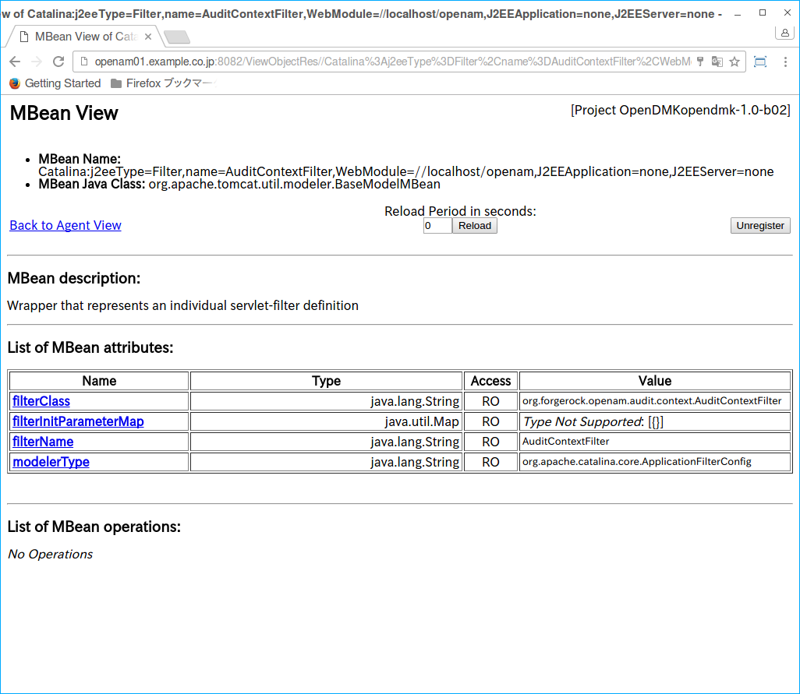
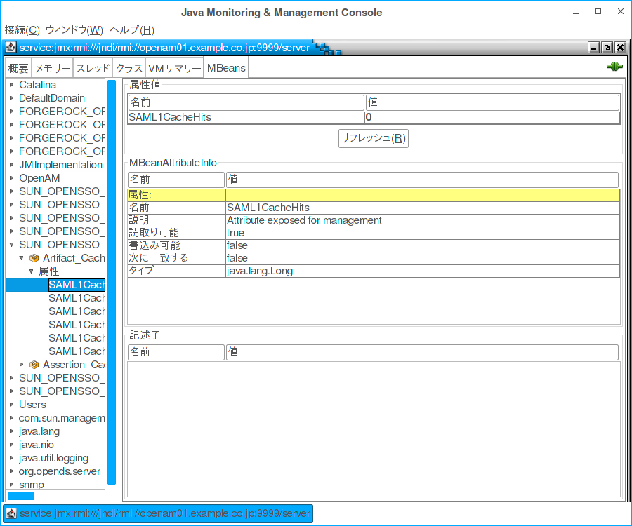

## OpenAMの監視

この章では、適切なパフォーマンスとサービスの可用性を確保するために、OpenAのサービスを監視する方法を説明します。

### 監視インターフェイス

OpenAMは、Java Management Extensions(JMX)や簡易ネットワーク管理プロトコル(SNMP)で、ウェブページを通してOpenAMを監視することができます。サービスは、JMXに基づいています。

監視サービスを設定するには、OpenAM管理者としてOpenAMコンソールにログインし、設定 > システム > 監視 を参照します。または、ssoadm set-attr-defsコマンドを使用することができます:

```
$ ssoadm \
 set-attr-defs \
 --servicename iPlanetAMMonitoringService \
 --schematype Global \
 --adminid amadmin \
 --password-file /tmp/pwd.txt \
 --attributevalues iplanet-am-monitoring-enabled=true
```

変更を有効(または無効)にするためには、OpenAMを再起動する必要があります。

#### Webベースの監視

http://openam-ter.example.com:8082/ のような、コアサーバが実行されるポート8082上で、OpenAMのMBeanのウェブベースのビューにアクセスできるようにOpenAMを設定することができます。コンソールを使用するか、ssoadmコマンドを使用します。

```
$ ssoadm \
 set-attr-defs \
 --servicename iPlanetAMMonitoringService \
 --schematype Global \
 --adminid amadmin \
 --password-file /tmp/pwd.txt \
 --attributevalues iplanet-am-monitoring-http-enabled=true
```

デフォルトの認証ファイルにより、HTTPを介してユーザーdemo、パスワードchangeitで認証することができます。ユーザー名とパスワードは指定したファイルに保管されています(パスワードが暗号化されます):

```
$ cat openam/openam/openam_mon_auth
demo AQICMBCKlwx6G3vzK3TYYRbtTpNYAagVIPNP
```

または:

```
$ cat openam/openam/opensso_mon_auth
demo AQICvSe+tXEg8TUUT8ekzHb8IRzVSvm1Lc2u
```

ampasswordをコマンドを使用して新しいパスワードを暗号化することができます。認証ファイルを変更したら、変更を有効にするためにOpenAMを再起動する必要があります。



#### JMX監視

JMXクライアントからの接続要求を受信できるようにOpenAMを設定することができます(デフォルトのポート番号は9999)。OpenAMのコンソールまたはssoadmコマンドのいずれかを使用します。前者の場合、設定 > システム > 監視 と遷移して、「監視システムの状態」と「監視システムの RMI インタフェースの状態」の両方が有効に設定されていることを確認して下さい:

```
$ ssoadm \
 set-attr-defs \
 --servicename iPlanetAMMonitoringService \
 --schematype Global \
 --adminid amadmin \
 --password-file /tmp/pwd.txt \
 --attributevalues iplanet-am-monitoring-enabled=true \
  iplanet-am-monitoring-rmi-enabled=true
```

jvisualvmやjconsoleなどいくつかのツールがJMXをサポートしています。例えば、OpenAMのMBeanを参照するためにjconsoleを使用すると、ローカルシステム上で実行するOpenAMのデフォルトのURLは、service:jmx:rmi:///jndi/rmi://localhost:9999/server のようになります。

```
$ jconsole service:jmx:rmi:///jndi/rmi://localhost:9999/server &
```

また、Webアプリケーションコンテナに接続することにより、MBeanを参照することができます。デフォルトでは、コンテナへのJMX監視は、プロセスIDを使用して、ローカルでのみアクセス可能である可能性が高いです。



リモートで接続する、SSLを使用するなどの方法については、以下のページを参照して下さい。 
Monitoring and Management Using JMX
http://docs.oracle.com/javase/1.5.0/docs/guide/management/agent.html

> **重要:**  
> JMXには、OpenAMからJMXへのいくつかの操作とCTSテーブルが正しくシリアライズされない制限があります。その結果、OpenAMの監視情報の一部のみがJMXを介して利用可能です。SNMPは、JMXよりも望ましいの監視オプションであり、特にCTSに対してシリアライゼーションの制限無しで、すべてのOpenAMのテーブルを公開します。

#### SNMP監視

SNMP監視用のポート8085をリッスンできるように、OpenAMを設定することができます。コンソールまたはssoadmコマンドを使用します。

```
$ ssoadm \
 set-attr-defs \
 --servicename iPlanetAMMonitoringService \
 --schematype Global \
 --adminid amadmin \
 --password-file /tmp/pwd.txt \
 --attributevalues iplanet-am-monitoring-snmp-enabled=true
```
