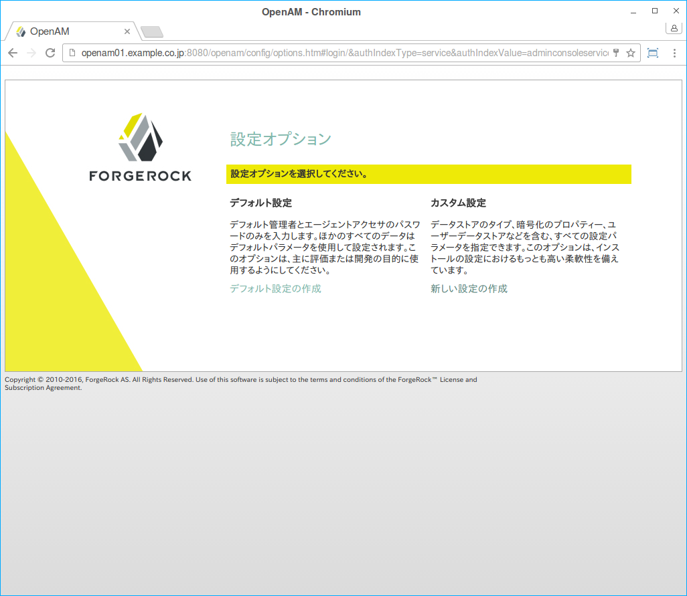

## OpenAMのインストールと初期設定

この章では、OpenAMをインストールと初期設定の方法について解説します。OSは、CentOS 7.0を使用しましたが、Windowsやそれ以外のOSでも基本的な手順は変わりません。

### OpenAMのインストール(デプロイ)

#### JDKのインストール

まずは、Javaがインストールされているか確認します。

```
$ java -version
openjdk version "1.8.0_101"
OpenJDK Runtime Environment (build 1.8.0_101-b13)
OpenJDK 64-Bit Server VM (build 25.101-b13, mixed mode)
```

Javaがインストールされていなければ、yumコマンドでOpenJDKをインストールします。

```
$ yum install java-1.8.0-openjdk
```

#### Tomcatのインストールと設定

yumコマンドにより、Tomcat 7.0をインストールします。

```
$ yum install tomcat
```

Tomcat起動時のJVMオプションには、以下を指定して下さい。

- *-server*  
    -client(クライアントVM)ではなく、-server(サーバーVM)を使用してください。通常、サーバーVMはクライアントVMよりも起動が遅いですが、長期的には実行速度を速くします。

- *-XX:MaxPermSize=256m*  
    Permanent 領域の最大値は256 MBに設定します。

- *-Xmx1024m*  
    OpenAMは、少なくとも1 GBのヒープを必要とします。組み込みOpenDJを含める場合は、そのスペースの50％がOpenDJに割り当てられるように、OpenAMには最低2 GBのヒープを設定します。システム構成によってはさらに追加のヒープを必要とします。

```
$ vi /usr/share/tomcat/conf/tomcat.conf

# 以下を追加
JAVA_OPTS="-server -Xmx1024m -XX:MaxPermSize=256m"
```

その他にも障害発生時の解析などのために、GCやヒープダンプに関するオプションは指定した方がいいです。

server.xmlのConnectorタグにURIEncoding="UTF-8"を追記して下さい。いくつかの画面の文字化けや文字コードに起因する問題を回避できます。

```
<Connector port="8080" protocol="HTTP/1.1"
   connectionTimeout="20000"
   redirectPort="8443" URIEncoding="UTF-8" />
```

#### OpenAMのデプロイとTomcatの起動

OpenAMはForgeRock社のサイトからをOpenAM 13.0.0のwarファイルをダウンロードできます。

https://backstage.forgerock.com/#!/downloads/OpenAM/OpenAM%20Enterprise/13.0.0/OpenAM%2013

> **情報**  
> ダウンロードするにはアカウント登録が必要です。

ダウンロードしたら、/usr/share/tomcat7/webapps/以下にコピーします。OpenAMのデプロイが完了したら、Tomcatを起動します。

```
$ mv OpenAM-13.0.0.war /usr/share/tomcat7/webapps/openam.war 

$ systemctl start tomcat
```

### OpenAMの初期設定

Tomcatの起動が確認できたら、次のURLにアクセスして下さい。

http://openam01.example.co.jp:8080/openam

デプロイが正常に完了していると、初期設定画面が表示されます。 「カスタム設定」の「新しい設定の作成」のリンクをクリックします。 



ライセンス条項が表示されるので、内容を確認して「Continue」をクリックして下さい。


手順1： 一般

デフォルトユーザーのパスワードを入力して、「次へ」ボタンをクリックします。デフォルトユーザー「amadmin」とは、OpenAM管理コンソールでOpenAMの設定をするための管理者アカウントのことです。


手順2： サーバー設定

サーバーURLに「 http://openam01.example.co.jp:8080 」を、Cookieドメインに「.example.co.jp」を入力して、「次へ」ボタンをクリックします。プラットフォームロケールはen_USのままで構いません。


手順3： 設定データストア設定

初めての初期設定なので、「最初のインスタンス」を選択して、「次へ」ボタンをクリックします。 


手順4： ユーザーデータストア設定

「OpenAMのユーザーデータストア」を選択して、「次へ」ボタンをクリックします。「OpenAMのユーザーデータストア」とは、OpenAMに内蔵されているディレクトリサーバー（OpenDJ）のことを意味します。
　


手順5： サイト設定

今回はロードバランサは使用しないので、「いいえ」を選択して 「次へ」ボタンをクリックします。


手順6： デフォルトのポリシーエージェントユーザー

デフォルトポリシーエージェントユーザーのパスワードを入力して、「次へ」ボタンをクリックします。パスワードは先程入力したamadminのパスワードとは異なるものにして下さい。


最後に設定に誤りがないことを確認して、「設定の作成」ボタンをクリックします。


初期設定が実行されます。


しばらくすると「設定が完了しました」というダイアログが表示されます。以上で、インストールと初期設定は完了です。 


この中にある「ログインに進む」のリンクをクリックすると、OpenAM管理コンソールのログイン画面が表示されます。


「amadmin」と手順1で設定したパスワードを入力して、ログインすることができます。
