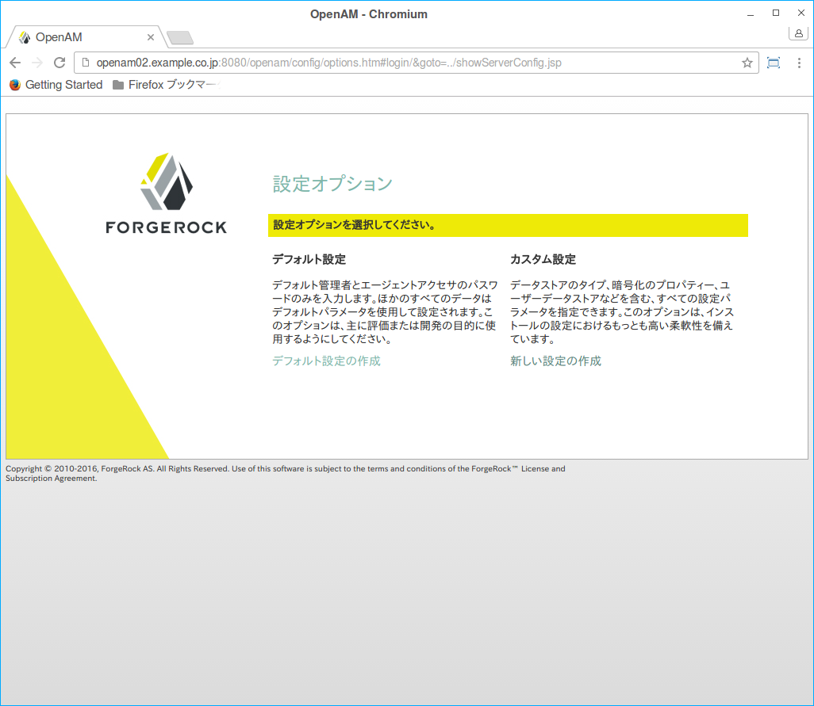
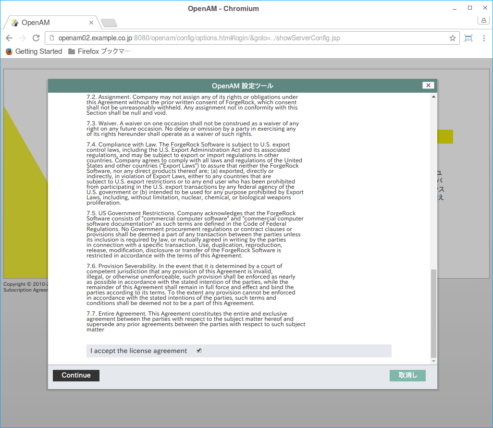
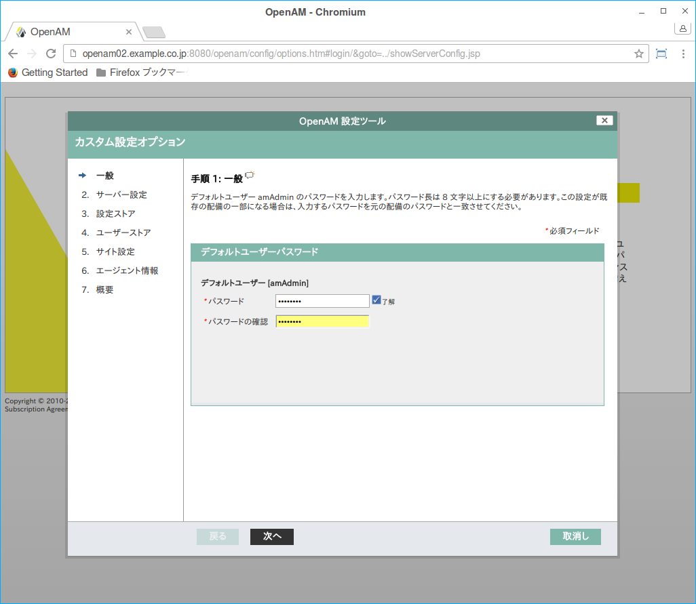
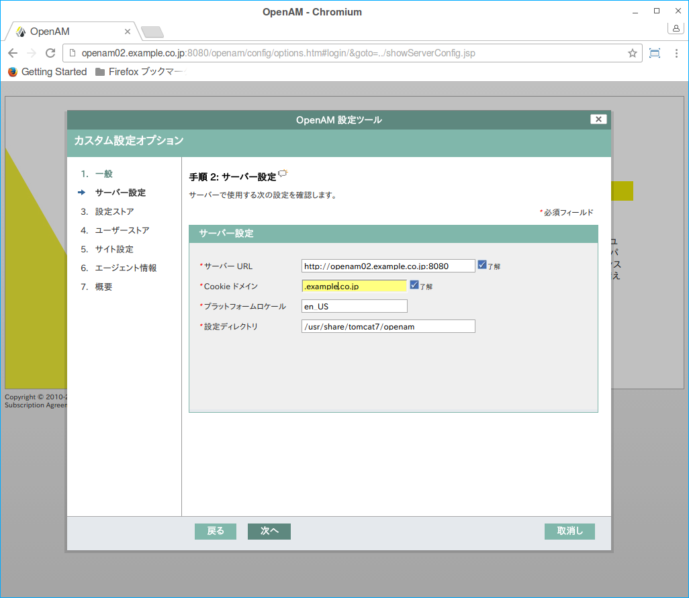
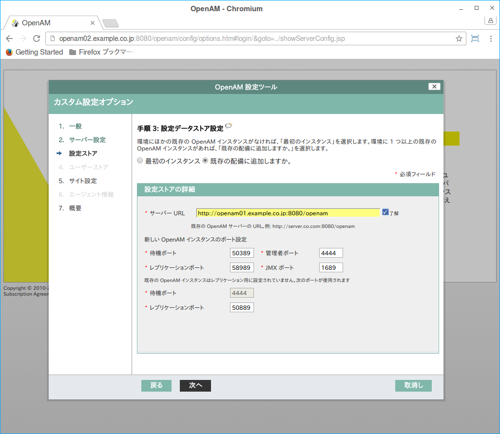
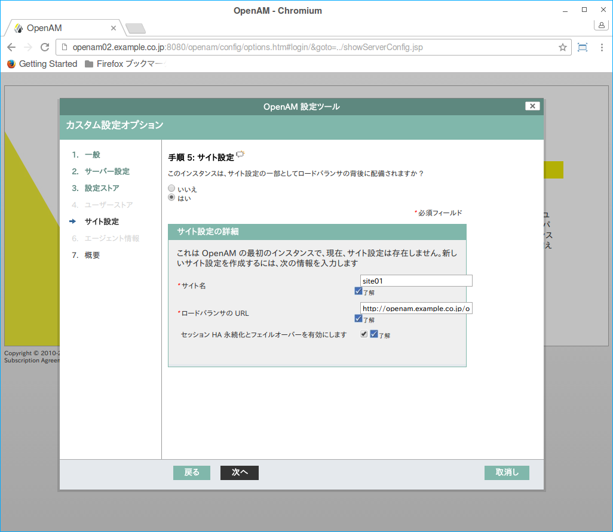
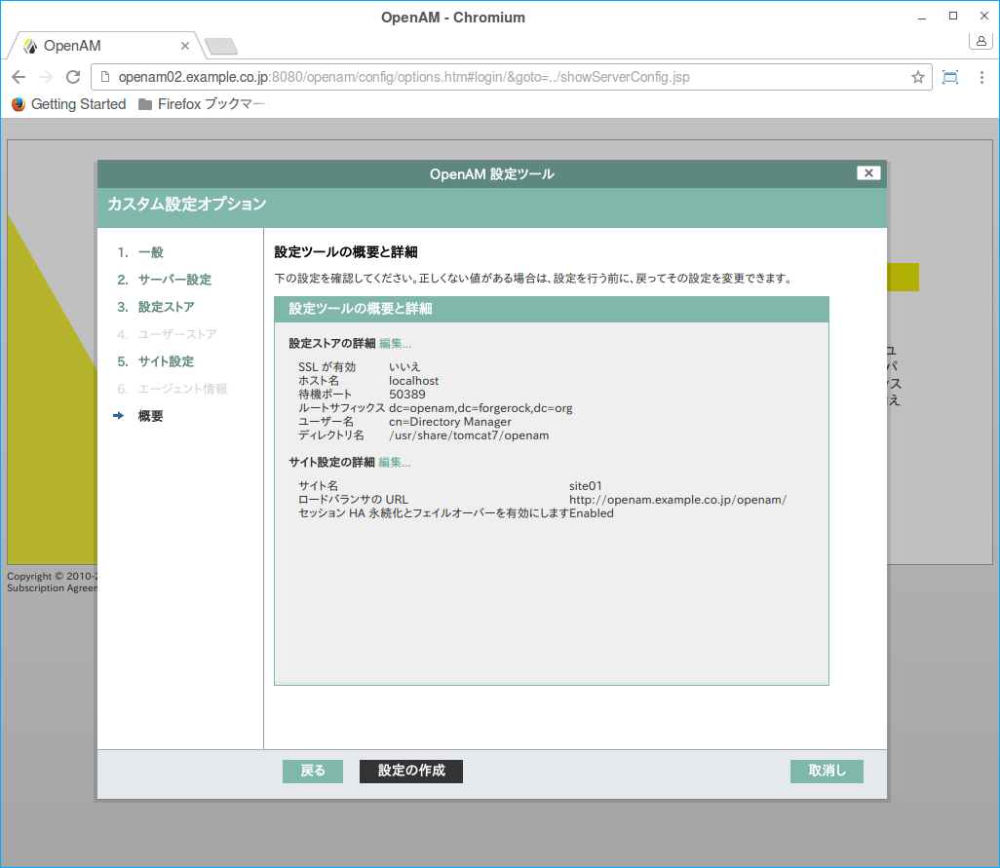
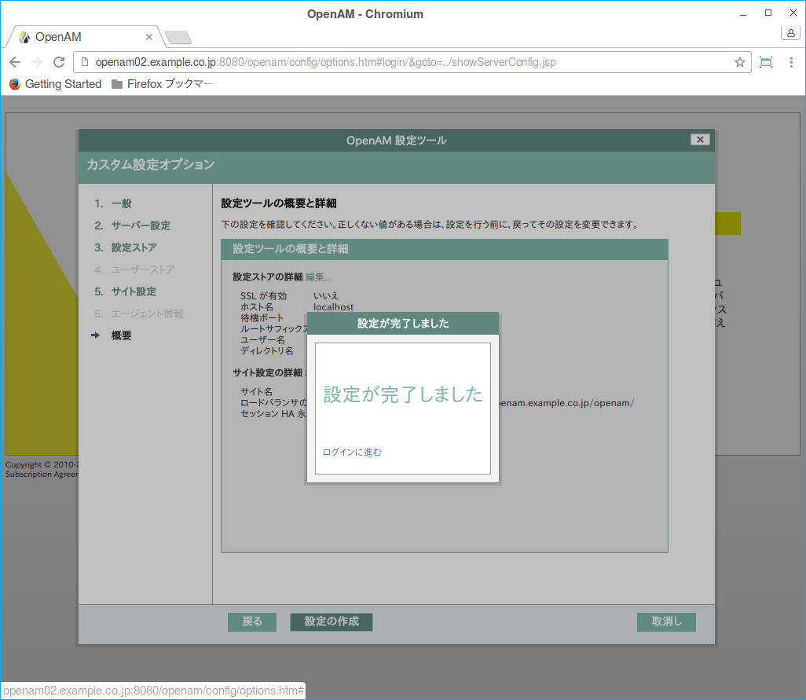
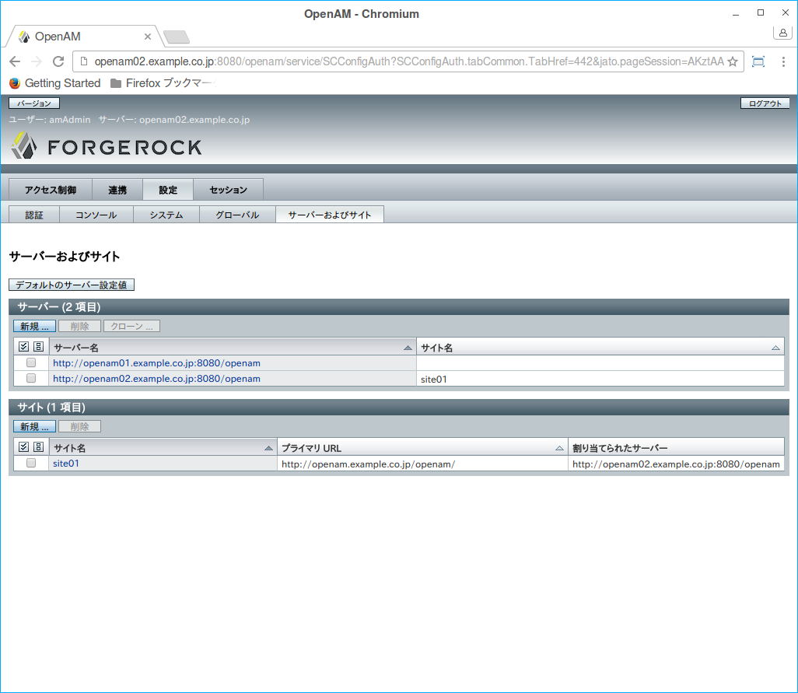
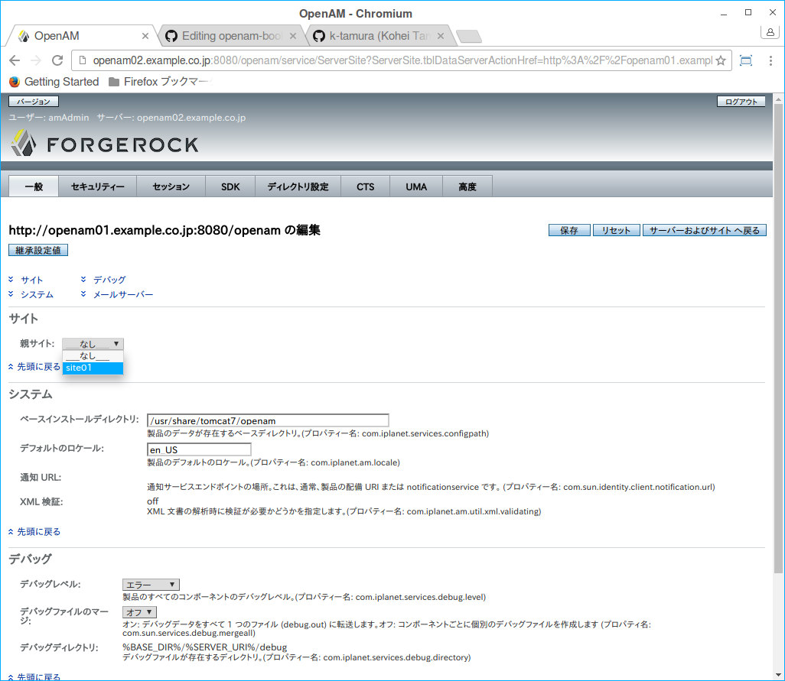

## 冗長化とセッションフェイルオーバー

この章では、OpenAMサーバーを冗長化して、ロードバランサーでリクエストを振り分けられるようにします。
前の章で行った1台目のOpenAMサーバーのセットアップに続き、2台目のOpenAMサーバーをセットアップして冗長構成にします。
OpenAMでは、このような冗長構成を「サイト構成」と呼びます。
また、OpenDJのレプリケーション機能を利用したセッションフェイルオーバーもできるように設定します。

次のようなサイトにロードバランサーがリクエストを振り分けるような構成を構築します。

- ロードバランサー：http://openam.example.co.jp/openam
- サイト(site01)
 - OpenAMサーバー1号機：http://openam01.example.co.jp:8080/openam
 - OpenAMサーバー2号機：http://openam02.example.co.jp:8080/openam

図. 構築する環境

### 2台のOpenAMの初期設定

1台目のOpenAMサーバーと同様に、http://openam02.example.co.jp:8080/openam でアクセスできるようにFQDNなどの設定し、TomcatにOpenAMのwarファイルをデプロイします。

warファイルをデプロイし、Tomcatの起動が確認できたら、次のURLアクセスして下さい。

http://openam02.example.co.jp:8080/openam

デプロイが正常に完了していると、初期設定画面が表示されます。 「カスタム設定」の「新しい設定の作成」のリンクをクリックします。 

ライセンス条項が表示されるので、内容を確認して「Continue」をクリックして下さい。

手順1： 一般

デフォルトユーザーのパスワードを入力して、「次へ」ボタンをクリックします。デフォルトユーザー「amadmin」とは、OpenAM管理コンソールでOpenAMの設定をするための管理者アカウントのことです。

手順2： サーバー設定

サーバーURLに「 http://openam01.example.co.jp:8080 」を、Cookieドメインに「.example.co.jp」を入力して、「次へ」ボタンをクリックします。プラットフォームロケールはen_USのままで構いません。

手順3： 設定データストア設定

2台目の初期設定なので、「既存の配備に追加」を選択して、1号機のOpenAMサーバーのURLを「サーバー URL」に入力します。URLに間違いがないと、各種ポート番号が自動的に設定されるので、問題がなければ、「次へ」ボタンをクリックします。 

手順5： サイト設定

今回はロードバランサを使用するので、「はい」を選択してます。 「サイト名」、「ロードバランサの URL」を入力し、「セッション HA 永続化とファイルオーバーを有効にします」にチェックします。完了したら、「次へ」ボタンをクリックします。

最後に設定に誤りがないことを確認して、「設定の作成」ボタンをクリックします。

しばらくすると「設定が完了しました」というダイアログが表示されます。以上で、2台目の初期設定は完了です。 

OpenAM管理コンソールに、設定を確認します。設定 > サーバーおよびサイト でサイト構成が確認できます。

上の図のように1号機がサイト構成に追加されていない場合は、1号機のサーバー URLをクリックして、サイトに追加して下さい。

### ロードバランサの設定

次にロードバランサの設定を行います。

