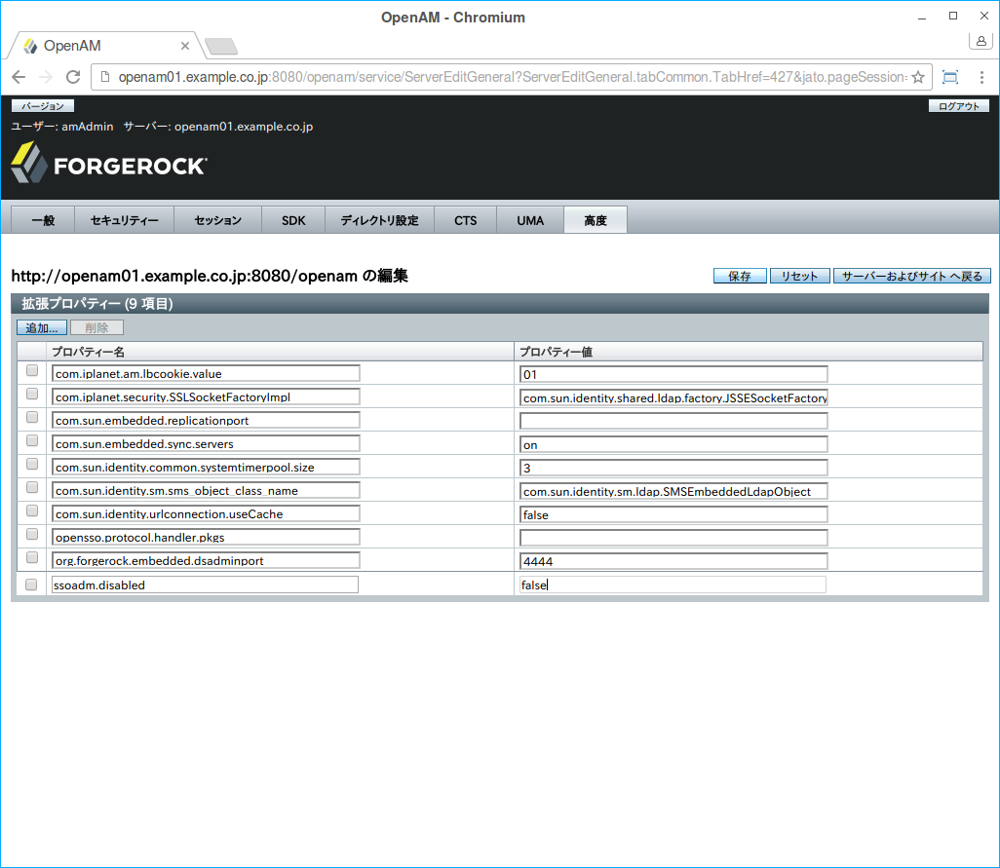
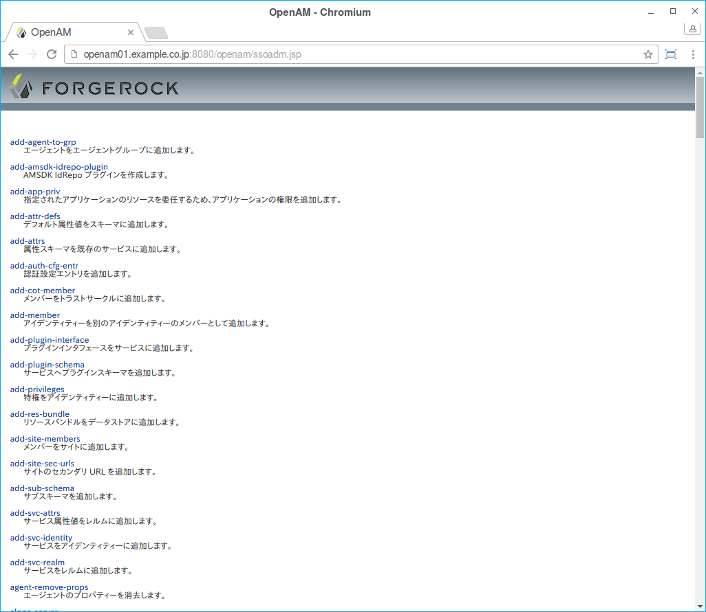

### ssoadm.jsp

ssoadmコマンドの設定機能の大規模なサブセットにアクセスするために、ssoadm.jspページを使用することができます。
ただし、ssoadm.jspは潜在的な悪用を防止するために、デフォルトでは無効になっています。

ssoadm.jspを有効にするには、OpenAMの管理者(amadmin)で管理コンソールにログインし、
設定 > サーバーとサイト > サーバー > URL をクリックします。

高度をクリックし、プロパティテーブルを表示したら、追加をクリックします。
表示されるテキストボックスに次の情報を含めて、保存をクリックします:

- プロパティ名

    ssoadm.disabled

- プロパティ値

    false

変更が有効になっていれば、/ssoadm.jsp (例 http://openam.example.com:8080/openam/ssoadm.jsp) にアクセスできます。

