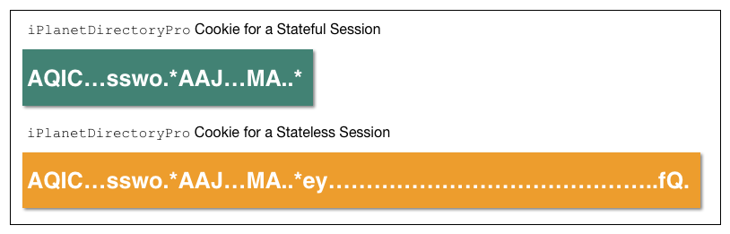

## ステートレスセッション

この章では、ステートフルセッションとステートレスセッションの違いについて説明し、OpenAMでの設定方法を示します。

### OpenAMのセッションについて

ユーザーが正常に認証されると、OpenAMはユーザーのリソースへのアクセスを管理するためにセッションを作成します。 OpenAMは、ユーザーのログインが有効であるか、またはユーザーを再認証する必要があるか判断するために、セッションに格納された情報を使用します。

OpenAMのセッションには「ステートレス」と「ステートフル」があり、以下のセクションで詳細に記載されています。

### ステートフルセッション

ステートフルセッションは、OpenAMサーバーのメモリに常駐するセッションで、セッションフェイルオーバーが有効になっている場合は、コアトークンサービスのトークンストアにも保持されます。OpenAMは、OpenAMのメモリ内のセッションへの参照(SSOトークン)をクライアントに送信しますが、それにはセッションの状態に関する情報はいっさい含まれていません。クライアントがブラウザの場合、OpenAMはセッションへの参照が含まれているCookieをブラウザに設定します。RESTクライアントの場合、OpenAMは認証エンドポイントへの呼び出しのレスポンスとともに、セッションへの参照を返します。

ステートフルセッションは可変です。セッションが存続する間、OpenAMサーバーはユーザーのセッションの様々な値を変更することができます。

### ステートレスセッション

ステートレスセッションは、セッションの状態に関する情報がOpenAMでエンコードされ、クライアントに送信されるセッションですが、セッション内の情報はOpenAMのメモリに保持されません。ブラウザベースのクライアントの場合、OpenAMはセッションの状態が含まれているCookieをブラウザに設定します。ブラウザがOpenAMにクッキーを送信すると、OpenAMはCookieをもとにセッションの状態を復元します。

ステートレスセッションは不変です。これは、OpenAMがユーザーのブラウザにステートレスセッションのCookieを設定してから、ユーザーがOpenAMをログアウトするかセッションが期限切れになるまで、Cookieを更新しないことを意味します。

### レルムでの設定

ステートフルセッションとステートレスセッションはレルム単位で設定できます。デフォルトではステートフルセッションが設定されています。指定されたレルムに認証しているすべてのユーザーのセッションは、個々のレルムの設定に応じて、ステートフルまたはステートレスのいずれかとなります。 OpenAMでは、いくつかのレルムでステートフルセッションを使用し、それ以外でステートレスセッションを使用するといった配備ができます。

しかし、レルムあたりのセッションの設定には1つの例外があります。トップレベルの管理者(デフォルトでは、amadmin)がOpenAMに認証されると、トップレベルのレルムがステートレスセッションで設定されている場合でも、常にセッションはステートフルになります。

### OpenAM認証中のセッションの状態

OpenAMで認証されている間は、ユーザーを認証したレルムがステートフルセッションに設定されているか、ステートレスセッションに設定されているかに関係なく、ユーザーのセッションをメモリ内に保持します。

認証が完了した後、OpenAMはステートレスセッションに設定されているレルムで認証されたユーザーのメモリ内のセッションを削除します。ステートフルセッションに設定されているレルムで認証されたユーザーのセッションは、OpenAMのメモリヒープに残ります。

### セッションのカスタマイズ

ポストの認証プラグインを使用すると、ステートフルセッションとステートレスセッションの両方でカスタム情報を保持することができます。ポスト認証プラグインの詳細については、OpenAM開発者ガイドの「Creating a Post Authentication Plugin」の章を参照してください。

## セッションCookie

OpenAMは、ステートフルとステートレスの両方のセッションのCookieを、認証されたユーザーのブラウザに書き込みます。デフォルトのCookie名は「iPlanetDirectoryPro」です。ステートフルセッションの場合、このCookieの値の大きさが比較的小さく(約100バイト)、OpenAMサーバー上のステートフルセッションへの参照とその他のいくつかの情報だけが含まれています。ステートレスセッションの場合、「iPlanetDirectoryPro」Cookieはかなり大きく(約2000バイト以上)、セッションがステートフルであったとすれば、OpenAMサーバーのメモリに保持されるすべての情報が含まれています。

ステートレスセッションCookieは、2つの部分から構成されています。クッキーの最初の部分はステートフルセッションのCookieと同じで、セッションタイプに関係なくCookieの互換性が保証されます。2番目の部は、ベース64エンコードされたJSON Webトークン(JWT)であり、以下の図に示すようにセッション情報が含まれています。

上の図は、ステートフルセッションとステートレスセッションのCookie値の差を示しています。図は縮尺通りではないことに注意して下さい。ステートレスセッションの「iPlanetDirectoryPro」Cookieは、ステートフルセッションよりも10倍以上大きいです。

ユーザーのセッションに追加属性を保持するようにOpenAMをカスタマイズする場合、ステートレスセッションのCookieのサイズが大きくなります。Cookieのサイズが、エンドユーザーのブラウザで許可される最大Cookieサイズを超えないことを確認にする必要があります。

### ステートレスセッションCookieのセキュリティ

ステートレスセッションCookieを使用する場合は、「iPlanetDirectoryPro」Cookieに挿入されたJWTを署名して暗号化するように、OpenAMを設定する必要があります。

ステートレスセッションCookie内のJWTの署名と暗号化のための設定は、「ステートレスセッションCookieのセキュリティの設定」の9.8項で説明されています。

#### JWT 署名

OpenAMは、シングルサインオンが要求されるたびに以前の認証の証明として、ユーザーのブラウザに「iPlanetDirectoryPro」Cookieを設定します。 OpenAMは、セッションサービスで設定された署名を検証することにより、Cookieが本物であることを検証します。 OpenAMは、Cookieまたはその署名の内容を改ざんしようとする、または不正な署名でCookieに署名しようとする可能性がある攻撃者を阻止します。

#### JWT 暗号

知識のあるユーザーは、base64でエンコードされたJWTを簡単にデコードすることができます。 OpenAMのセッションには機密と見なされる情報が含まれているため、セッションが含まれているJWTを暗号化することで不透明性を確保することにより、その内容を保護します。

JWTの暗号化は、全てのOpenAMセッションの状態を記録することが可能なman-in-the-middle攻撃を防ぎます。暗号化は、エンドユーザーが自分のOpenAMセッション内の情報にアクセスすることができないことも保証します。

### コアトークンサービスの使用方法

OpenAMは、ステートフルセッションとステートレスセッションで異なるコアトークンサービスを使用します。

ステートフルセッションでは、セッションフェイルオーバーが有効になっている場合、OpenAMはユーザーセッションを保存するために、コアトークンサービスのトークンストアを使用します。OpenAMサーバーで障害が発生した場合は、1つ以上のバックアップサーバーがセッションフェイルオーバー中にユーザーのログインセッションを再確立するために、コアトークンサービスのトークンストアからセッションを取得することができます。

ステートレスセッションでは、OpenAMはコアトークンサービスのトークンストア内のユーザーセッションを保存しません。その代わりに、OpenAMは、ユーザーのブラウザ上の「iPlanetDirectoryPro」Cookie内にセッションを保存します。OpenAMサーバーに障害が発生した場合、ユーザーのリクエストを処理する別のサーバーは、単に「iPlanetDirectoryPro」Cookieからステートレスセッションを読み込みます。他のサーバーに対してセッションを読むことができるように、セッションフェイルオーバーを有効にする必要はありません。

セッションブラックリストは、コアトークンサービスのトークンストアにログアウトしたステートレスセッションのリストを保持するオプション機能です。次のセクションでは、ステートレスセッションのセッションブラックリストを含むセッションログアウトについて説明します。

### セッションの終了

OpenAMは、認証されたユーザーがOpenAMの制御下のシステムリソースにアクセスしようとしたときに、シングルサインオンを可能にするアクティブなセッションを管理します。

設定されたタイムアウトに到達したとき、またはユーザーがセッション終了の原因となるアクションを実行したときに、ユーザーのセッションが終了されることが保証されます。セッションの終了は、OpenAMによって保護されているすべてのシステムから、効果的にユーザーをログアウトします。

ステートフルセッションでは、OpenAMは4つの状況でセッションを終了します。

- ユーザーが明示的にログアウトしたとき
- セッションを監視する管理者が明示的にセッションを終了したとき
- セッションが最大存続時間を超えたとき
- ユーザーが最大セッションアイドル時間を超過してアイドル状態であるとき

このような状況下で、OpenAMは、セッションが存在するOpenAMサーバーのメモリヒープから、および(セッションフェイルオーバーが有効になっている場合は)コアトークンサービスのトークンストアから、ステートフルセッションを削除することによって応答します。メモリ内のユーザーのステートフルセッションがなくなると、OpenAMは、OpenAMによって保護されたリソースへの追加のアクセスの試行するユーザーに再認証を強制します。

ユーザーが明示的にOpenAMをログアウトすると、OpenAMも無効なセッションIDや有効期限の切れたCookieを指定したSet-Cookieヘッダを送信することにより、ユーザーのブラウザの「iPlanetDirectoryPro」Cookieを無効化しようとします。管理者のセッション終了とセッションタイムアウトの場合、OpenAMは、ユーザーがOpenAMにアクセスする次の時間まで「iPlanetDirectoryPro」Cookieを無効にすることはできません。

セッションの終了は、ステートレスセッションごとに異なります。ステートレスセッションがOpenAMのメモリに保持されていないので、管理者はステートレスセッションを監視または終了することができません。認証後に、OpenAMはステートレスセッション用の「iPlanetDirectoryPro」Cookieを変更しないので、セッションアイドル時間はCookie内に維持されていません。したがって、OpenAMはアイドルタイムアウトを超過したステートレスセッションを自動的には終了しません。

ステートフルセッションと同じように、ユーザーがログアウトするときにOpenAMはユーザーのブラウザの「iPlanetDirectoryPro」Cookieを無効化しようとします。最大セッション時間を超過すると、OpenAMもユーザーが次にOpenAMにアクセスする時間でユーザーのブラウザの「iPlanetDirectoryPro」Cookieを無効化しようとします。

OpenAMがCookieの無効化を保証することはできないことを理解することは重要です。例えば、Set-Cookieヘッダーを含むHTTPレスポンスが失われる可能性があります。これはステートフルセッションの問題ではなく、(ログアウトされたステートフルセッションはもはやOpenAMのメモリ内に存在しないため、)以前にログアウトした後でOpenAMを再アクセスしようとするユーザーは、再認証を強制されます。

ただし、Cookieの無効化の保証の欠如はステートレスセッションでの配備における問題です。ログアウトしたユーザーが「iPlanetDirectoryPro」Cookieを保持する可能性はあります。OpenAMは、ユーザーが以前にログアウトしていることを決定することができません。したがって、OpenAMはユーザーがステートレスセッションからログアウトするときに、追加のアクションを実行する機能をサポートしています。 OpenAMは、コアトークンサービスのトークンストア内のセッションブラックリストに、ログアウトしたステートレスセッションのリストを維持することができます。ユーザーはステートレスセッションでOpenAMにアクセスしようとするたび、ユーザーが(実際には)ログアウトしていないか検証するため、OpenAMはセッションのブラックリストをチェックします。

セッションブラックリストのオプションの詳細については、「セッションブラックリストの設定」を参照して下さい。

### ステートフルセッションとステートレスセッションのどちらを選択するか

ステートフルセッションを使用すると、OpenAMは特定のサーバーへユーザーのセッションを結び付けます。サーバーはOpenAMのサイトに追加することができますが、サーバーが追加されるたびに、短いセッションの生存期間を想定しながら、徐々に全体的なワークロードのバランスを取る必要があります。 OpenAMサーバーに障害が発生した場合、セッションはコアトークンサービスのトークンストアから取得されます。したがって、パフォーマンスが回復するまでに時間がかかることがあります。ユーザーがユーザーのホームサーバーではないOpenAMサーバーに到着するたびに、クロストーク(冗長なサーバー間通信)が発生します。より多くのサーバーがサイトに追加されるとサーバー間の調整はより複雑になるので、OpenAMのサイトへのサーバーの追加は、水平方向にスケーラブルな方法でパフォーマンスを向上しません。

ステートレスセッションは、次のような利点を提供します:

- イラスティシティ(Elasticity)と水平方向のスケーラビリティー  
 ステートレスセッションを使用すると、OpenAMサーバーをサイトに追加および削除でき、セッションの負荷は水平にバランスをとることができます。ピーク時と通常時のシステム負荷の間に有意な差があるとき、非常に大きなユーザー数を持つクラウドの配備のためにイラスティシティが重要です。

- よりシンプルなロードバランシングの設定  
 ステートレスセッションは、最適なパフォーマンスを実現するために、スティッキーセッションが有効なロードバランサーを使用する必要がありません(より簡単に複数のサーバー上にOpenAMの配備を行うことができます)。

ステートフルセッションは、次のような利点を提供します:

- 同等のホストとより高速なパフォーマンス  
 ステートレスセッションの場合、OpenAMサーバーにより大きなサイズのCookieを送信して、Cookie内のJWTを復号化する必要があります。復号化操作はOpenAMサーバーのパフォーマンスに大幅に影響を与えます(ホストあたり、秒あたりのセッションの検証数を減らすことができます)。

 ステートレスセッションを使用すると水平方向のスケーラビリティが向上するので、OpenAMの配備に複数のホストを追加することによって、ホスト上の全体的なパフォーマンスを簡単に改善できます。

- 機能のフルサポート  
ステートフルセッションは、OpenAMのすべての機能をサポートしていますが、ステートレスセッションはそうではありません。ステートレスセッションとOpenAMの使用の制限については、「ステートレスセッションを使用する場合の制限事項」を参照して下さい。

- セッション情報がブラウザのクッキーに存在しない  
 ステートフルセッションでは、セッションに関するすべての情報はOpenAMサーバー上に存在します。ステートレスセッションでは、セッション情報はブラウザのCookie内に保持されています。この情報は非常に長い有効期間にできます。

表. ステートフルおよびステートレスセッションを使用したOpenAMの配備での影響

|配備方法|ステートフルセッション|ステートレスセッション|
|---|---|---|
|ハードウェア|高いRAM消費量|高いCPU消費量|
|論理ホスト|ホストの数が少ない|ホストの数が多いまたは可変|
|セッション監視|利用可能|利用できない|
|セッションの保存先|OpenAMサーバのメモリヒープ内|ユーザーのブラウザのクッキー内|
|セッションフェイルオーバー|ロードバランサのスティッキーセッション設定が必要|スティッキーセッション設定は不要|
|コアトークンサービスの使用|セッションフェイルオーバーをサポート|ログアウトしたセッションのためにセッションブラックリストをサポート|
|コアトークンサービスの需要|重い|軽い|
|セッションのセキュリティ|OpenAMサーバー上のメモリ内に存在するため、セッションはユーザーにはアクセスできない|セッションは、署名および暗号化する必要がある|
|ポリシーエージェント|ポリシーエージェントにキャッシュされたセッションは、変更通知を受け取ることができる|ポリシーエージェントにキャッシュされたセッションは、変更通知を受信できない|

### ステートレスセッションのインストール計画

セッションブラックリストは、ログアウト処理中にコアトークンサービスのトークンストアを使用します。コアトークンサービスを配備する方法の詳細については、インストールガイドのコアトークンサービスの設定を参照してください。

また、OpenAMが使用するトラストストアに必要な証明書がインストールされていることを確認してください。

- 証明書は、ステートレスセッションを含むJWTを暗号化するために必要とされます。
- RS256の署名を使用している場合、証明書はJWTに署名するために必要です(HMAC署名は共有シークレットを使用します)。

同証明書は、OpenAMサイトに参加している全てのサーバーに格納される必要があります。

### ステートレスセッションの設定

レルムにステートレスセッションを設定するには、次の手順を実行します:

**手順. レルム内でステートレスセッションを有効にする**

1. レルム > レルム名 > 認証 > 設定 > 一般 をクリック。
2. 「ステートレスセッションを使用する」のチェックボックスをチェックします。
3. 保存ボタンをクリック。

管理者以外のユーザーがレルムに認証される時にOpenAMがステートレスセッションを作成していることを確認するには、次の手順を実行します:

**手順. ステートレスセッションが有効になっていることを確認する**

1. トップレベルの管理者(デフォルトでは、amadmin)としてOpenAMコンソールにログインします。トップレベルの管理者のOpenAMセッションは常にステートフルであることに注意して下さい。
2. 「セッション」タブを選択します。
3. amadminのセッションが存在していることを確認します。
4. ブラウザ内の、デフォルトではiPlanetDirectoryProで名付けられているOpenAMのCookieを調べます。Cookieの値をテキストファイルにコピーアンドペーストし、そのサイズに注意して下さい。
5. amadminの「iPlanetDirectoryPro」Cookieにアクセスすることができないプライベートブラウザセッションを起動します:
 - Chromeでは、シークレットウィンドウを開きます。
 - Internet Explorerでは、プライベートブラウジングを開始します。
 - Firefoxでは、新しいプライベートウィンドウを開きます。
 - Safariでは、新しいプライベートウィンドウを開きます。
6. ステートレスセッションを有効にしたレルムに対して、管理者以外のユーザーとしてOpenAMにログインします。この時、管理者ユーザーとしてログインしないように注意して下さい。
7. ブラウザ内の、「iPlanetDirectoryPro」Cookieを調べます。Cookieの値を2番目のテキストファイルにコピーアンドペーストし、そのサイズに注意して下さい。ステートレスセッションCookieの値の大きさは、amadminユーザーのためのステートフルセッションCookieの値のサイズよりもかなり大きいはずです。クッキーが大きくない場合は、正しくステートレス・セッションが有効になっていません。
8. 管理コンソールが表示されている元のブラウザウィンドウに戻ります。
9. 「セッション」画面を表示しているウィンドウをリフレッシュします。
10. amadminのセッションがまだ表示されていて、ステートレスセッションが有効になっているレルムの管理者以外のユーザーのセッションが表示されないことを確認します。

### ステートレスセッションCookieのセキュリティの設定

ステートレスセッションを使用するときは、「iPlanetDirectoryPro」CookieにJWTを署名し、暗号化する必要があります。

ステートレスセッションCookieのセキュリティを設定する前に、必要に応じて証明書を配備していることを確認してください。OpenAMの証明書の管理の詳細については、証明書の管理を参照してください。

ステートレスセッションCookieのJWTのセキュリティを確保するには、JWTに署名を設定し、JWT全体を暗号化します。次のセクションでは、ステートレスセッションCookieのセキュリティを設定するための詳細な手順を提供します。

ステートレスセッションCookieのセキュリティの詳細については、ステートレスセッションCookieのセキュリティを参照してください

> **重要**  
> OpenAMサイト内に複数のOpenAMサーバーを配備する場合、すべてのサーバーが同じセキュリティ設定になっている必要があります。共有シークレットとセキュリティキーは同一でなければなりません。共有シークレットまたはキーを変更する場合は、サイト上のすべてのサーバーに変更を加える必要があります。

#### JWTの署名の設定

ステートレスセッションCookieの悪質な改ざんを防止するためには、JWTの署名の設定が必要です。

JWTの署名を設定するには、次の手順を実行します:

**手順. JWTの署名の設定する**

1. 設定 > グローバル > セッション に移動し、ステートレスセッションのセクションを見つけます。
2. 署名アルゴリズムのタイプを指定します。デフォルト値はHS256です。
3. HMAC署名アルゴリズムを指定した場合は、署名HMAC共有秘密のフィールドの値を変更します(生成されたデフォルト値を使用したくない場合)。
4. RS256の署名アルゴリズムを指定した場合は、JWTの署名の署名に使用する署名RSA証明書エイリアスのフィールドに値を指定します。
5. 保存ボタンをクリックします。

セッションサービスの設定属性の詳細については、OpenAM Referenceの「セッション」のエントリを参照してください。

#### JWTの暗号化の設定

man-in-the-middleの攻撃者がユーザーのセッションの詳細へのアクセスすことや、エンドユーザーがJWTのコンテンツを調べることを防止するに、JWTの暗号化を設定します。

JWTを暗号化するには、次の手順を実行します:

**手順. JWTの暗号化を設定する**

1. 設定 > グローバル > セッション に移動し、ステートレスセッションのセクションを見つけます。
2. NONE以外の値で暗号化アルゴリズムのタイプを指定します。
3. 暗号化RSA証明書のエイリアスには、JWTの署名を暗号化するために使用す値を指定します。
4. 保存ボタンをクリックします。
5. OpenAMサイト内のすべてのOpenAMサーバー上で、JWTの署名の設定が同一であることを確認してください。

セッションサービスの設定属性の詳細については、OpenAM Referenceの「セッション」のエントリを参照してください。

### セッションブラックリストの設定

セッションブラックリストは、ステートレスセッションからログアウトしたユーザーがOpenAMに再認証することなく、シングルサインオンを実現することができないことを保証します。

セッションブラックリストを設定するには、次の手順を実行します:

**手順. セッションブラックリストを設定する**

1. OpenAMインストール時にコアトークンサービスを配備していることを確認してください。セッションブラックリストは、コアトークンサービストークンストアに保存されます。
2. 設定 > グローバル > セッション に移動し、ステートレスセッションのセクションを見つけます。
3. ステートレスセッションのセッションブラックリストを有効にするには、セッションブラックリストオプションを有効にするを選択します。1つまたは複数のOpenAMレルムにステートレスセッションを設定する場合、複数のOpenAMサーバー間のセッションログアウトを追跡するために、セッションブラックリストを有効にする必要があります。
4. セッションブラックリストキャッシュサイズプロパティを設定します。
  OpenAMはログアウトしたステートレスセッションのキャッシュを保持します。キャッシュサイズは、最大セッション時間に予想されるログアウト数程度でなければなりません。最大セッション時間中にログアウトの予想数が10,000よりも大きいオーダーがある場合、10,000のデフォルト値を変更します。低く設定されたセッションのブラックリスト・キャッシュは、キャッシュからブラックリストのエントリを得るのではなく、コアトークンサービスストアからそれらを読み込むため、小さなパフォーマンスの低下を引き起こします。
5 ブラックリストのポーリング間隔プロパティを設定します。
  セッションブラックリストが有効な場合、OpenAMは、ログアウトしたセッションへの変更に対してコアトークンサービスをポーリングします。デフォルトで、ポーリング間隔は60秒です。ポーリング間隔が長いほど、悪意のあるユーザーがクラスタ内の他のOpenAMサーバーに接続し、盗んだセッションクッキーを利用する必要がある時間も長くなります。ポーリング間隔を短くすると、ログアウトしたセッションのセキュリティを改善しますが、ネットワーク活動の増加により、全体的なOpenAM性能の最小限の低下を招く可能性があります。
6. ブラックリストパージ遅延プロパティを設定します。
  セッションのブラックリストが有効な場合、OpenAMはブラックリストパージ遅延に最大セッション時間を加えた時間で、ログアウトしたそれぞれのセッションを追跡します。たとえば、セッションの有効期限が120分でブラックリストパージ遅延が1分の場合、OpenAMは121分間セッションを追跡します。OpenAMサーバーのクラスタのシステムクロックスキューが1分よりも大きくなることが予想される場合、ブラックリストパージ遅延を増加します。ネットワークタイムプロトコルのようなクロック同期プロトコルを実行しているサーバーに対して、ブラックリストパージ遅延を増加させる必要はありません。
7. 保存ボタンをクリックします。

セッションサービスの設定属性の詳細については、OpenAM Referenceの「セッション」のエントリを参照してください。

### ステートレスセッションを使用する場合の制限事項

次のOpenAMの機能は、ステートレスセッションを使用するレルムでサポートされていません。

- 認証レベルとセッションアップグレード
- セッション割り当ての設定
- 現在のセッションプロパティを参照する条件を含む認可ポリシー
- クロスドメインシングルサインオン
- SAML v2.0シングルサインオンとシングルログアウト
- SAML v1.xシングルサインオン
- SNMPセッション監視
- OpenAMコンソールを使用したセッション管理
- セッション通知
