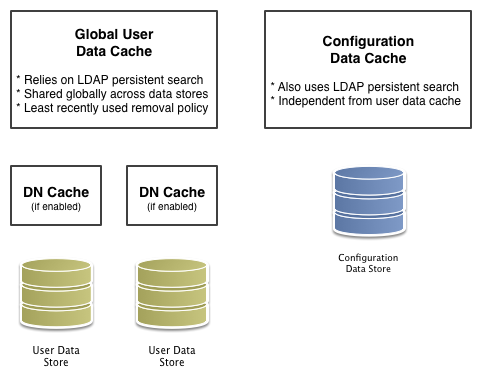

[TODO] ※このページは作成中です。

この章では、OpenAMの動作をスムーズにし、応答時間を最小限に抑えつつ、スループットを最大化するための、キーとなるチューニング項目について説明します。

> **注意:**  
> ここで提供される推奨事項が、すべての状況で正しい設定ではないということに注意して下さい。

パフォーマンスチューニングのアドバイスが適用される範囲は、システム要件、ワークロード、どの程度のリソースが利用可能であるかに大きく依存します。本番環境にOpenAMをデプロイする前に十分なテストを行って下さい。

この章の提案は、次の特性を持つOpenAMの配備に関連します:

- OpenAMサーバーを実行しているホストが、大量のメモリを持っている。
- コアトークンサービス専用のOpenDJを配備できる。OpenDJを実行しているホストは、大容量のメモリと、複数のCPUを搭載するハイエンドサーバーである。
- OpenAMサーバーはステートフルセッションを使用するように設定されている。

これまでの経験則から、本番環境においてステートフルセッションを使用するように構成された3GBのヒープのOpenAMサーバーであれば、10万セッションを処理することができます。64ビットJVMで大規模なヒープを使用した方がいいと考えるかもしれませんが、小さいヒープの方が管理が容易です。このように、同時セッション数の合計を増やすためには、単一のサーバーをスケールアップするよりも、むしろ、より多くのサーバーを追加することにより、スケールアウトする方がいいです。

### OpenAMサーバー設定

OpenAMには、パフォーマンスを向上させるために調整できるいくつかの設定があります。

#### 一般設定

一般的なポイントとして以下が挙げられます。

- デバッグレベルをエラーに設定する。
- コンテナレベルのロギングを、エラーや重大などの低いレベルに設定する。

#### LDAP 設定

LDAPデータストア、LDAP認証モジュール、CTSおよび設定ストアの接続プールをチューニングします。

##### LDAP データストア設定

LDAPデータストアの設定を変更するには、OpenAMの管理コンソールの レルム > レルム名 > データストア > データストア名 にアクセスします。 データストア毎に独自の接続プールがあるので、データストア毎に独自のチューニングが必要です:

表. LDAP データストア設定

|プロパティ|デフォルト値|提案|
|---|---|---|
|LDAP接続プール最小サイズ|1|LDAP接続プールの最小サイズ。推奨値は10です。  (sun-idrepo-ldapv3-config-connection_pool_min_size)|
|LDAP接続プール最大サイズ|10|LDAP接続プールの最大サイズ。推奨値は65です。  LDAPサーバーがクライアントの最大数に対応できることを確認してください。  (sun-idrepo-ldapv3-config-connection_pool_max_size)|

##### LDAP認証モジュールの設定のチューニング

LDAP認証モジュールの接続プールの設定を変更するには、OpenAMの管理コンソールの 設定 > 認証 > コア にアクセスします:

表. LDAP認証モジュール設定

|プロパティ|デフォルト値|提案|
|---|---|---|
|デフォルトLDAP接続プールサイズ|1:10|LDAP認証モジュールで使用されるLDAP接続プールの最小数と最大数。本番環境での推奨値は10:65です。  (iplanet-am-auth-ldap-connection-pool-default-size)|

##### CTSおよび設定ストアの設定のチューニング

コアトークンサービス(CTS)のLDAP接続プールの設定をチューニングする場合、CTSをバックアップしているディレクトリサービスと、OpenAMの設定をバックアップしているディレクトリサービスが同じであるかどうかによって、変更する内容が異なります。

両者が同じである場合(デフォルトの場合)、要求された任意のLDAP操作に対して、OpenAMの設定にアクセスするサービスとCTSは、同じ接続プールを共有します。この場合、有効期限切れのCTSトークンのクリーンアップのために、コネクションが一つ予約されます。2の累乗に最も近い約半分のコネクションが、CTSの操作のために割り当てられます(※1 )。残りのコネクションは、OpenAMの設定にアクセスするサービスに割り当てられます。デフォルトの設定では、プール内のコネクションの最大数は10で、1つのコネクションが有効期限切れのCTSトークンのクリーンアップに、4つのコネクションが他のCTSの操作に、5つのコネクションが設定にアクセスするサービスに割り当てられます。プール内のコネクションの最大数が20の場合、1つのコネクションが有効期限切れのCTSトークンのクリーンアップに、8つのコネクションが他のCTSの操作に、11つのコネクションが設定にアクセスするサービスに割り当てられます。65の場合は、それぞれ1、32、32となります。

最小コネクション数は6です。

CTSをバックアップするディレクトリサービスが外部にある場合(OpenAMの設定をバックアップするディレクトリサービスとは異なる場合)、CTS用のディレクトリサービスにアクセスするために使用される接続プールは、OpenAMの設定データ用のディレクトリサービスにアクセスするために使用されるプールとは、異なります。一つのコネクションが有効期限が切れたCTSトークンのクリーンアップのために予約されています。残りのコネクションは、割り当てられたコネクションの数が2の累乗に等しくなるように、CTS操作に割り当てられます。この場合、9、17、33、65のように2^n+1の最大コネクション数を設定します。

同じディレクトリサービスがCTSとOpenAMの設定の両方をバックアップする場合、 設定 > サーバーおよびサイト > サーバー名 > ディレクトリ設定 のプールサイズを設定します。

CTSをバックアップしているディレクトリサービスが外部にある(OpenAMの設定をバックアップしているディレクトリサービスとは異なる)場合は、設定 > サーバーおよびサイト > サーバー名 > CTS > 外部ストア設定 の最大接続プールサイズを設定します。

両方のケースで、デフォルトの接続タイムアウトを変更する必要がある場合、設定 > サーバーおよびサイト > サーバー名 > 高度 の、次に説明する詳細なプロパティを設定します:

表. CTSストアLDAP接続プールの設定

|プロパティ|デフォルト値|提案|
|---|---|---|
|最大接続プール|10|管理コンソールで 設定 > サーバーおよびサイト > サーバー名 > ディレクトリの設定 をクリックします。同じディレクトリサービスがOpenAMの設定とCTSの両方をバックアップする場合は、CTSのための9個のコネクションと、OpenAMの設定にアクセスするための10個のコネクション(例えば、ポリシーの検索などを含む)を可能にするために、少なくともこれを19に増やすことを検討してください。|
|最大接続数|10|管理コンソールの 設定 > サーバーおよびサイト > サーバー名 > CTS > 外部ストア設定 で、この設定を検索します。 CTSのバックアップディレクトリサービスが外部にあり、CTSの負荷が高い場合、この設定を2^n+1にすることを検討してください(n = 4, 5, 6, など)。つまり、高負荷の下でパフォーマンスをテストする際に、17、33、65のような値にこれを設定してみてください。 (org-forgerock-services-cts-store-max-connections)|
|CTS 接続タイムアウト (高度なプロパティ)|10 (秒)|ディレクトリサーバへのほとんどのCTSリクエストは速やかに処理されるので、ほとんどの場合、デフォルトのタイムアウトで問題ありません。性能テストのために、この設定を変更する場合、設定 > サーバーおよびサイト > サーバー名 > 高度 で、高度なプロパティorg.forgerock.services.datalayer.connection.timeout.cts.asyncを設定します。 変更を有効にするには、OpenAMが実行されるコンテナを再起動する必要があります。|
|CTS リーパータイムアウト (高度なプロパティ)|無し|CTSトークンのクリーンアップコネクションは、多くの結果を返す可能性がある時間のかかるクエリを要求するために使用されるので、一般的にタイムアウトしないようにしてください。パフォーマンステストのために、この設定を変更する場合、設定 > サーバーおよびサイト > サーバー名 > 高度 で、高度なプロパティorg.forgerock.services.datalayer.connection.timeout.cts.reaperに希望の秒数を設定します。 変更を有効にするには、OpenAMが実行されるコンテナを再起動する必要があります。|
|設定管理接続タイムアウト (高度なプロパティ)|10 (秒)|ディレクトリサーバーへのほとんどの設定管理要求は速やかに処理されるので、ほとんどの場合、デフォルトのタイムアウトで問題ありません。パフォーマンステストのために、この設定を変更する場合、設定 > サーバーおよびサイト > サーバー名 > 高度 で、高度なプロパティorg.forgerock.services.datalayer.connection.timeoutを設定します。|

変更を有効にするには、OpenAMを再起動する必要があります。

#### 通知設定

OpenAMは、クライアントに通知を送信するために使用される2つのスレッドプールを持っています。サービス管理サービス（SMS）スレッドプールは、OpenAMコンソールの 設定 > サーバーおよびサイト > デフォルトサーバー設定 > SDK 以下で調整することができます:

表. SMSの通知設定

|プロパティ|デフォルト値|提案|
|---|---|---|
|通知プールサイズ|10|通知を送信するために使用されるスレッドプールのサイズです。本番環境では、SMS通知のために多数のクライアントが登録されていない限り、デフォルト値のままで問題ないはずです。  (com.sun.identity.sm.notification.threadpool.size)|

セッションサービスは、ステートフルセッションへの変更についてリスナーに通知を送信するための独自のスレッドプールも持っています。これについては、設定 > サーバーおよびサイト > デフォルトサーバー設定 > セッション 以下に設定されています:

表. セッションサービスの通知設定

|プロパティ|デフォルト値|提案|
|---|---|---|
|通知プールサイズ|10|通知を送信するために使用されるスレッドプールのサイズです。本番環境では、25〜30程度にする必要があります。 (com.iplanet.am.notification.threadpool.size)|
|通知スレッドプールのしきい値|5000|送信されるのを待っているキュー内の通知の最大数です。一般的な構成においては、デフォルト値で問題ないはずです。 (com.iplanet.am.notification.threadpool.threshold)|

####  セッション設定

セッションサービスには、チューニングのための追加のプロパティがあります(設定 > サーバーおよびサイト > デフォルトサーバー設定 > セッション 以下に設定されています)。次の提案は、ステートフルセッションを使用した配備に適用されます:

表. セッション設定

|プロパティ|デフォルト値|提案|
|---|---|---|
|最大セッション数|5000|本番環境では、この値を100,000に設定することができます。最大セッションの制限は、JVMのヒープの最大サイズによって制御されます(実際には同時セッション数の期待値と一致するように適切に調整されなければなりません)。 (com.iplanet.am.session.maxSessions)|
|セッションのパージ遅延|0|セッションがすぐにパージされることを保証するためにはゼロにする必要があります。 (com.iplanet.am.session.purgedelay)|

###  Java仮想マシン設定

このセクションでは、OpenAMを実行する際のJVMオプションの設定について解説します。
これらの設定は、より詳細なガベージコレクションのチューニング作業の前の、本番環境用のベストプラクティスな構成として、利用できます:

表. ヒープサイズ設定

|JVMパラメータ|推奨値|説明|
|---|---|---|
|-Xmsと-Xmx|少なくとも1024MB(組み込みOpenDJを使用する場合は2048MB)、本番環境では少なくとも2048MB～3072MB。  この設定は、使用可能な物理メモリや、32ビットまたは64ビットのJVMが使用されているかどうかに依存する。|-|
|-server|-|サーバーモードのJVMが使用されることを保証する。|
|-XX:PermSizeと-XX:MaxPermSize|両方とも256MBに設定。|JVM内のパーマネント領域のサイズを制御する。|
|-Dsun.net.client.defaultReadTimeout|60000|JavaのHTTPクライアントの実装における読み取りタイムアウトを制御します。  この設定は、Sun/Oracle HotSpot JVMに適用されます。|
|-Dsun.net.client.defaultConnectTimeout|高い値: 30000 (30秒)|JavaのHTTPクライアントの実装における読み取りタイムアウトを制御します。   秒間数百のリクエストを受信する場合は、巨大なコネクションキューを避けるために、この値を減らします。  この設定は、Sun/Oracle HotSpot JVMに適用されます。|

表. セキュリティ設定

|JVMパラメータ|推奨値|説明|
|---|---|---|
|-Dhttps.protocols|TLSv1,TLSv1.1,TLSv1.2 (JDK 7、JDK 8向け)  TLSv1 (JDK 6向け)|OpenAMからのHTTPS接続に使用されるプロトコルを制御する。|

この設定は、Sun/Oracle HotSpot JVMに適用されます。

ガベージコレクション設定

|JVMパラメータ|推奨値|説明|
|---|---|---|
|-verbose:gc|-|一般的なガベージコレクションの情報を出力する。|
|-Xloggc:|$CATALINA_HOME/logs/gc.log|ガーベッジコレクションのログファイルのパス。|
|-XX:+PrintClassHistogram|-|SIGTERMシグナルをJVMが受信した際に、ヒープのヒストグラムを出力する。|
|-XX:+PrintGCDetails|-|ガベージコレクションの詳細情報を出力する。|
|-XX:+PrintGCTimeStamps|-|ガベージコレクションの詳述なタイムスタンプを出力する。|
|-XX:+HeapDumpOnOutOfMemoryError|-|OutofMemoryErrorが発生したときに、自動的にヒープダンプを生成する。|
|-XX:HeapDumpPath|$CATALINA_HOME/logs/heapdump.hprof|ヒープダンプのパス。|
|-XX:+UseConcMarkSweepGC|-|CMS(コンカレントマークスイープ)ガベージコレクタを使用する。|
|-XX:+UseCMSCompactAtFullCollection|-|フルガベージコレクションでの積極的なコンパクションを行う。|
|-XX:+CMSClassUnloadingEnabled|-|CMSスイープ時のクラスのアンロードを許可する。|

### OpenAMでのキャッシング

ユーザー情報や設定情報を必要とするたびに、ユーザーデータストアや設定データストアを照会する必要がなくなるように、OpenAMはデータをキャッシュします。デフォルトでOpenAMは、キャッシュされたデータへの変更の通知を受信するために、LDAP持続検索を使用します。このような理由から、LDAP持続検索をサポートするディレクトリサーバーにデータが保存されるときにキャッシングすることが最適です。

OpenAMには、サーバー側で設定することができる2種類(設定データ用とユーザーデータ用)のキャッシュがあります。一般的に、設定データキャッシュに対してはデフォルト設定を使用します。このセクションでは、主にユーザーデータのキャッシュの設定について解説します。

OpenAMは、ユーザーデータストアに対してグローバルユーザーデータキャッシュを実装しています。 OpenAM  11.0以前では、二次生存時間(TTL)のデータストアのキャッシュ層をサポートしていましたが、OpenAM 11.0以降のバージョンで削除されました。

ユーザーデータストアは、認証時に爆発的に発生する傾向があるDNルックアップをキャッシュするために使用される、DNキャッシュをサポートしています。ベースとなるLDAPストアのユーザーが移動したり、名前が変更されるときに、DNキャッシュが古くなる可能性があります(常に持続検索の結果に反映されないイベント)。ベースとなるLDAPストアは、持続的な検索やDN更新操作をサポートしている場合（つまり、DNの移動または名前を変更することができる場合）、DNキャッシュを有効にすることができます。

次の図は、2種類のキャッシュと、ユーザデータのために利用可能なキャッシュの2つのタイプを示しています。

図. OpenAMのキャッシュ

このセクションの残りの部分では、グローバルユーザーデータキャッシュとSDKクライアントのための主な設定を解説します。
データストアのキャッシュ設定については、"表. LDAPデータストアの設定"を参照してください。

#### 全体的なサーバーのキャッシュ設定

デフォルトでOpenAMは、設定データとユーザーデータの両方キャッシュを有効にしています。これは、サーバープロパティcom.iplanet.am.sdk.caching.enabledによって制御されており、デフォルトでtrueです。このプロパティをfalseに設定すると、設定データとユーザーデータのキャッシュを個々に有効にできます。

**手順. グローバルユーザーデータ・キャッシングをオフにする**

キャッシュを無効にすると、性能に深刻な悪影響を与える可能性があります。キャッシュが無効な場合、OpenAMは必要とするたびにデータストアにデータを照会しなければならないためです。

ただし、LDAP持続検索をサポートしていないユーザーデータストアを少なくとも1つ使用している場合は、ユーザーデータのグローバルキャッシュを無効にする必要があります。それ以外の場合、ユーザーデータキャッシュは、ユーザーデータエントリへの変更と同期し続けることができません:

1. 管理コンソールで、設定 > サーバーおよびサイト > サーバー名 > 高度 をクリックします。
2. 全体のキャッシュが無効になるように、com.iplanet.am.sdk.caching.enabledをfalseに設定します。
3. 設定データキャッシュを有効になるように、com.sun.identity.sm.cache.enabledをtrueに設定します。  
    前のステップでcom.iplanet.am.sdk.caching.enabledをfalseに設定することにより、ユーザーデータおよび設定データのキャッシングの両方を無効にしたため、明示的にこのプロパティをtrueに設定する必要があります。
4. 変更を保存します。
5. OpenAMは、変更を監視するために、可能な場合は(※2)ユーザーデータストアの持続検索を開始します。ユーザーデータストアのキャッシュを無効にすると、OpenAMは結果を使用しない場合でも、持続検索を開始します。  
    そのため、パフォーマンスの向上のためにユーザーデータストアのキャッシュを無効にする場合、ユーザーデータストアの持続検索も無効にする必要があります。ユーザーデータストアの持続検索を無効にするには、持続検索ベースDNの設定プロパティ値を削除し、空白のままにします。 レルム > レルム名 > データストア > データストア名 > 持続検索制御 の下に、このプロパティがあります。

**手順. グローバルユーザーデータ・キャッシングの最大サイズを変更する**

大規模なユーザーデータストアでアクティブユーザー数が多い場合、キャッシュ内のユーザーエントリの数が大きくなる可能性があります:

1. 管理コンソールで、設定 > サーバーおよびサイト > デフォルトサーバー設定 > SDK をクリックします。
2. SDKキャッシュの最大サイズの値を変更し、保存をクリックします。  
    大規模な配備では、設定エントリの数がユーザーエントリの数とほぼ同じ大きさに成長する可能性がないので、設定データには対応する設定が存在しません。

#### Java EEのポリシーエージェントおよびSDKクライアントのキャッシュプロパティ

OpenAMサーバーとして表「OpenAMのキャッシュプロパティ」に記載されているものとほぼ同じプロパティを使用して、ポリシーエージェントや他のOpenAMのSDKクライアントもユーザーデータをキャッシュできます。しかし、OpenAMからの通知や、OpenAMへのポーリングにより(通知が失敗した場合)、クライアントは更新を受け取ることができます。

**手順. クライアントキャッシュのアップデートの通知とポーリングを有効にする**

この手順では、ポリシーエージェントのユーザーデータキャッシュの更新のための変更通知とポーリングを有効にする方法について説明します。.propertiesファイルを使用してカスタムのOpenAMのSDKクライアントを設定する場合は、ポリシーエージェントの設定と同じプロパティを使用します:

1. 管理コンソールで、レルム > レルム名 > エージェント > エージェントタイプ > エージェント名 をクリックし、ポリシーエージェントのプロファイルを表示し、編集します。
2. グローバルタブページで、エージェント通知URLが設定されていることを確認してください。  
    通知が有効になっている場合、エージェントはこのURLで通知リスナーをOpenAMに登録します。  
    対応するプロパティはcom.sun.identity.client.notification.urlです。
3. 変更を保存します。  
    変更を有効にするには、ポリシーエージェントを再起動する必要があります。

#### キャッシュ設定

以下の表は、主にユーザーデータキャッシュの設定についてのクイックリファレンスを提供します。

設定データキャッシュ用の多くのプロパティは名前にsm（サービス管理用）があり、ユーザデータ用の多くのプロパティは名前にidm（アイデンティティ管理用の）があるることに注意してください:

表. OpenAMキャッシュプロパティ

|プロパティ|説明|デフォルト|適用対象|
|---|---|---|---|
|com.iplanet.am.sdk.cache.maxSize|キャッシュされるユーザーエントリの最大数。|10000|Server and SDK|
|com.iplanet.am.sdk.caching.enabled|設定データとユーザーデータの両方のキャッシュを有効にするかどうか。 trueの場合、この設定はcom.sun.identity.idm.cache.enabledとcom.sun.identity.sm.cache.enabledを上書きます。 falseの場合、前述のプロパティを使用して、設定データ用とユーザーデータ用に独立してキャッシュを有効にすることができます。|true|Server & SDK|
|com.iplanet.am.sdk.remote.pollingTime|ポリシーエージェントのようなSDKクライアントが、変更されたユーザーデータエントリに対してどのくらいの頻度(分単位)でOpenAMにポーリングすべきか。SDKは、要求された最も古い変更の世代を決定するためにも、この値を使用しています。要求された最も古い変更は、この設定よりも2分経過しています。言い換えると、デフォルトでSDKは最後の3分で変更したエントリに対してポーリングします。これを0または負の整数に設定すると、ポーリングを無効になります。|1 (分)|SDK|
|com.sun.am.event.notification.expire.time|変更に対するのクライアントのポーリングが変化を見逃さないように、キャッシュされたエントリに与えられた変更をどの程度の期間、OpenAMが保存するか。|30 (分)|Server only|
|com.sun.identity.idm.cache.enabled|com.iplanet.am.sdk.caching.enabledがtrueの場合、このプロパティは無視されます。それ以外の場合、ユーザーデータキャッシュを有効にするには、これをtrueに設定してください。|false|Server & SDK|
|com.sun.identity.idm.cache.entry.default.expire.time|グローバルユーザデータ・キャッシュ内のユーザデータエントリを保存する分数。|30 (分)|Server & SDK|
|com.sun.identity.idm.cache.entry.expire.enabled|グローバルユーザーデータ・キャッシュ内のユーザーデータエントリが有効期限切れになるかどうか。|false|Server & SDK|
|com.sun.identity.idm.remote.notification.enabled|ポリシーエージェントのようなSDKクライアントが、OpenAMサーバーにユーザーデータに対する変更の通知リスナーを登録する必要があるかどうか。OpenAMがどこに通知を送信すべきか知っているようにリスナーを登録するため、SDKクライアントはcom.sun.identity.client.notification.urlで指定されたURLを使用します。何らかの理由で通知を有効にできない場合は、SDKクライアントは、変更に対してポーリングすることをフェイルバックします。|true|SDK|
|com.sun.identity.sm.cache.enabled|com.iplanet.am.sdk.caching.enabledがtrueの場合、このプロパティは無視されます。それ以外の場合、設定データキャッシュを有効にするには、これをtrueに設定してください。常にtrueに設定することをお勧めします。|false|Server & SDK|
|sun-idrepo-ldapv3-dncache-enabled|ユーザデータのDNキャッシュを有効にするには、これをtrueに設定します。|false|Server & SDK|
|sun-idrepo-ldapv3-dncache-size|キャッシュサイズを設定します。|1500|Server & SDK|

※1 正確には、CTSの操作のために割り当てられたコネクションの数は、プール内のコネクションの半分の最大数に最も近い2の累乗に等しいです。

※2 OpenAM starts persistent searches on user data stores on directory servers that support the psearch control. 
