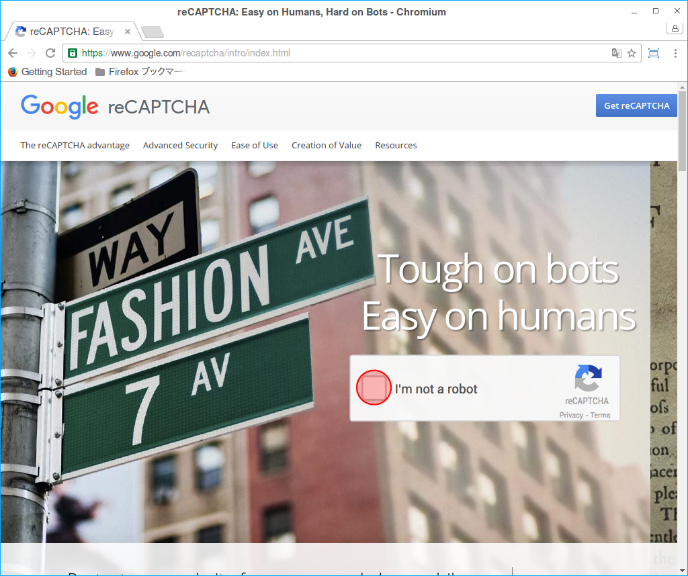

## ユーザーセルフサービス

[TODO] ※このページは現在作成中です。

OpenAM 12.0.0から、XUIベースの「ユーザーセルフサービス」という機能が導入されました。ユーザセルフサービスは、次のようなユーザー自身の情報を管理するためのサービスです。

- ユーザー自身によるアカウントの登録
- パスワードのリセット
- ログイン時に使用したデバイスの管理
- UMAのリソース共有管理

アカウント登録やパスワードリセットの際にKBA(Knowledge Based Authentication：ナレッジベース認証)やGoogle reCAPTCHAで本人性を確認するといったことも可能になっています。この章では、これらの
機能の一例として、KBAとGoogle reCAPTCHAを使ったパスワードリセット機能について紹介します。

この機能を設定した場合、ユーザーがパスワードをリセットするフローは次のようになります。

図. パスワードリセットのフロー

OpenAMにおけるKBAとは、いわゆる秘密の質問と回答のことです。ユーザーが設定した秘密の質問を回答することで本人であることを確認する仕組みです。Google reCAPTCHAは、Googleが提供する、ロボットによるなりすましを防止する機能です。パスワードをリセットするプロセスで、KBAとreCAPTCHAを使って、本人性を確認します。

図. リキャプチャのデモ

**手順. KBAとGoogle reCAPTCHAを使ったパスワードリセット機能を設定する**  

1. まずはGoogle側の設定をします。Googleアカウントでログインしてから、Google reCAPTCHAのページにアクセスし、このページの右上の「Gget reCAPTCHA」ボタンをクリックします。

   図. Google reCAPTCHAのサイト

   

2. 適当なラベル名とOpenAMサーバーのドメインを入力します。私の環境では、OpenAMサーバーのホスト名(FQDN)がopenam09.example.co.jpなので、Domainsには「example.co.jp」と入力します。入力したら「Register」ボタンをクリックします。

図. サイトの登録

   

   完了すると、「Site key」と「Secret key」が発行されます。これらの値は、後でOpenAMの設定で使用するので、このページはこのまま開いておいて下さい。

   図. キーの発行

   

3. 次に、OpenAMの設定を行います。管理コンソールにamadminでログインして、設定 > グローバル > User Self Service をクリックします。

   図. Google reCAPTCHAのサイト

   画面の最上部に「Google Re-captcha Site key」と「Google Re-captcha Secret key」の入力欄があるので、先ほど取得した値を入力します。

   図. グローバル設定一覧

   画面の中央部に「Forgotten Password」のセクションがあるので、全てのチェックボックスにチェックを入れて、「保存」ボタンをクリックします。

   図. ユーザーセルフサービスの設定 (1)

パスワードをリセットするためのURLはメールでユーザーに通知するため、「電子メールサービス」の設定も必要です。設定 > グローバル > 電子メールサービス をクリックします。

図. ユーザーセルフサービスの設定 (2)

送信可能なSMTPサーバーのホスト名、ポート番号、認証ユーザーのIDとパスワードを入力して下さい。

図. 電子メールサービスの設定

これで、基本的な設定は完了です。

パスワードリセットの動作検証するために、適当な名前でユーザーを作成します。作成したら、電子メールアドレスを設定して下さい。

Screenshot-7

管理コンソールからログアウトして、秘密の質問と回答を設定するため、作成したユーザーでOpenAMにログインします。

Screenshot52

適当な質問を選択し、その回答を入力します。今回は秘密の質問はデフォルトで用意されている「What is the name of your favourite restaurant?」(お気に入りのレストランは？)で、回答は「denny’s」(デニーズ)としました。

※日本語で設定して、日本語で回答することも可能です。

Screenshot91

**手順. 動作確認**  

それでは、実際に動作確認してみましょう。OpenAMのログイン画面にアクセスして下さい。「Forgotten Password」のチェックがしてある場合(有効の場合)は、以下のように「Forgot Password」のリンクが表示されます。

Screenshot51

このリンクをクリックすると、Google reCAPTCHの画像が表示されます。「私はロボットではありません」にチェックを入れます。

Screenshot-1

すると、次のような画像認証システムが表示されます。画面の指示に従って、画像を選択して「確認」ボタンをクリックして下さい。

Screenshot-2

パスワードリセット画面が表示されるので、メールアドレスを入力して「SUBMIT」ボタンをクリックします。

Screenshot-3

登録したアドレスにメールが送信された旨が表示されるので、メールを確認してみます。

screenshot-41

これまでの設定に問題がなければ、パスワードをリセットするためのページにアクセスするためのリンクを含んだメールが送信されているはずです。

mail

リンクをクリックすると、秘密との質問に対する回答を入力する画面が表示されます。先ほど設定した回答(denny’s)を入力して下さい。

screenshot-61

間違いがなければ、パスワードリセット画面が表示されます。新しいパスワードを入力して、パスワードをリセットして下さい。

Screenshot-7

これでパスワードがリセットされました。

screenshot-81

以上で完了です。
